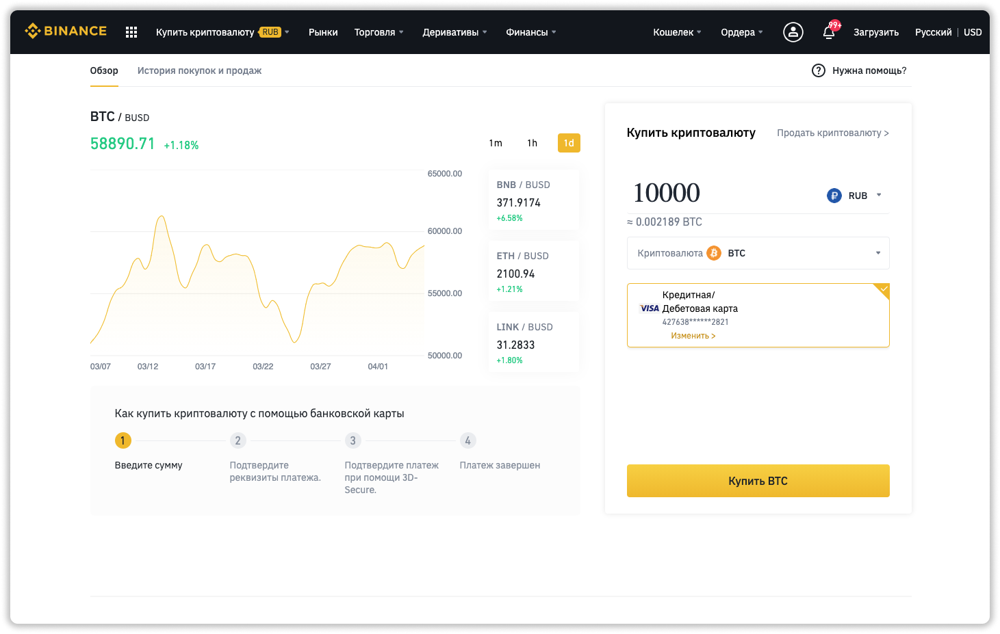
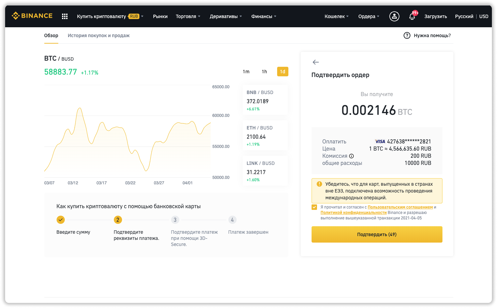
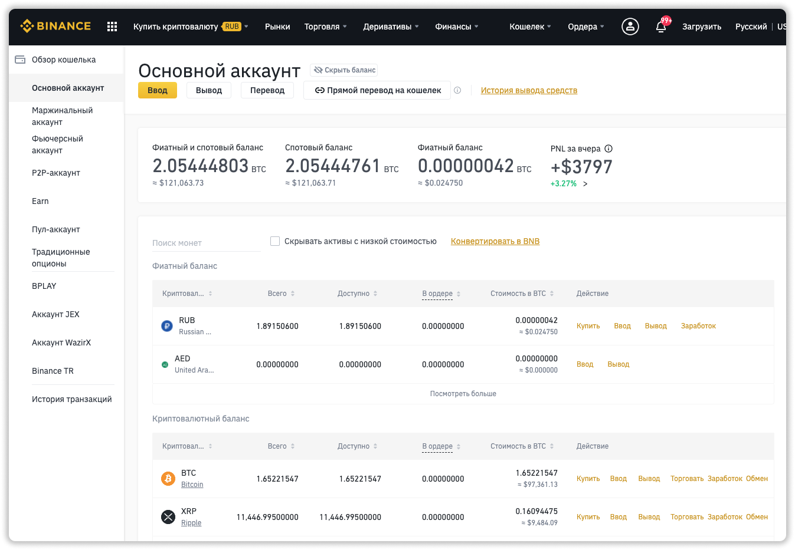

### ❗️Мои каналы о крипте и хайпах: 
📱 [Telegram](https://t.me/pyromidinvest) 
📺 [YouTube](https://www.youtube.com/channel/UCc7s-9Ki7Is7YbCPpWzPcFw) 
🤳 [Instagram](https://instagram.com/pyromidi)
***

Купить криптовалют (bitcoin, usdt, ethereum и др.) на binance.com можно за практически любую валюту: рубли, гривны, тенге, доллары, евро и так далее. Нюансы этого способа в том, что вы покупаете напрямую у binance и максимальный лимит составляет $10 000 в месяц. 

Если вам нужно купить больше криптовалюты, воспользуйтесь **[моей инструкцией по p2p торговле binance](/kupit-crypto-na-binance-p2p/)**. Тут нет ограничений.

## Что нужно для покупки криптовалюты на binance.com?
***

1) Быть [зарегистрированным](https://www.binance.com/ru/register?ref=21175927) в бирже binance
2) Пройти [верификацию](https://pyromid.ru/verifikaciya-binance/) личности и адреса
3) Иметь банковскую карту

## Шаг 1: заходим в раздел покупки
***

**1.1** Авторизируетесь на binance.

**1.2** В меню выбираете пункт **Купить криптовалюту** → **Кредитная / дебетовая карта**.

## Шаг 2: выбираем криптовалюту
***

**2.1** Выбираете вашу национальную валюту, то, чем будете платить.

**2.2** Выбираете криптовалюту, которую хотите купить.

**2.3** Вводите количество денег, на которые хотите купить криптовалюту.

**2.4** Нажимаете кнопку **Купить**

**2.5** Если у вас банковская карта еще не привязана, то binance попростит ввести данные банковской карты и место проживания / регистрации. Если ранее уже привязана, то переходите к следующему пункту **2.6**.

**2.6** Проверяете еще раз все данные. Посмотрите сколько вы получите и какая комиссия. И нажимаете **Подтвердить**.

**2.7** Появится окно банка, где нужно вести код из sms. 

После оплаты ожидайте 1-2 минуты и приступайте к **шагу 3**.

## Шаг 3: проверяем свой баланс
***

Средства уже куплены и теперь мы просто посмотрим доступны ли они.

**3.1** Заходим в меню **Кошелек** → **Фиат и спот**.

**3.2** Ищем в списке криптовалют купленную вами. В столбце **Доступно** появятся купленное вами количество криптовалюты. 

**3.3** Далее можете вывести криптовалюту нажав на кнопку **Вывод**.

## Binance не дает купить криптовалюту, что делать?
***

**1.** Банк отклоняет операцию. Необходимо позвонить в свой банк и поинтересоваться почему.

**2.** Если вы привязали новую банковскую карту, то binance требуется 1-2 суток для её проверки. В момент оплаты может произойти ошибка и платеж не пропустят. Вам нужно просто подождать 1-2 дня. Но чтобы ускорить, напишите в поддержку.

**3.** Вы не можете купить или не хватает лимита, так как не прошли верификацию. Без верификации не получиться купить криптовалюту на binance. [Инструкция по верификации тут](https://pyromid.ru/verifikaciya-binance/). 

**4.** Не хватает предоставленного лимита на покупку. Тут несколько путей: пройти верификацию адреса, написать в поддержку по увеличению лимита или воспользоваться [p2p торговлей на binance](/kupit-crypto-na-binance-p2p/).

## Не нашли ответ на вопрос?
***
Смело пишите мне в [Telegram](https://t.me/girlwithbun). Постараюсь решить проблему. А благодарностью за это, будет круто, если вы подпишитесь на мой канал в [Telegram](https://t.me/pyromidinvest), там я даю информацию про криптовалюту, инвестиции.
