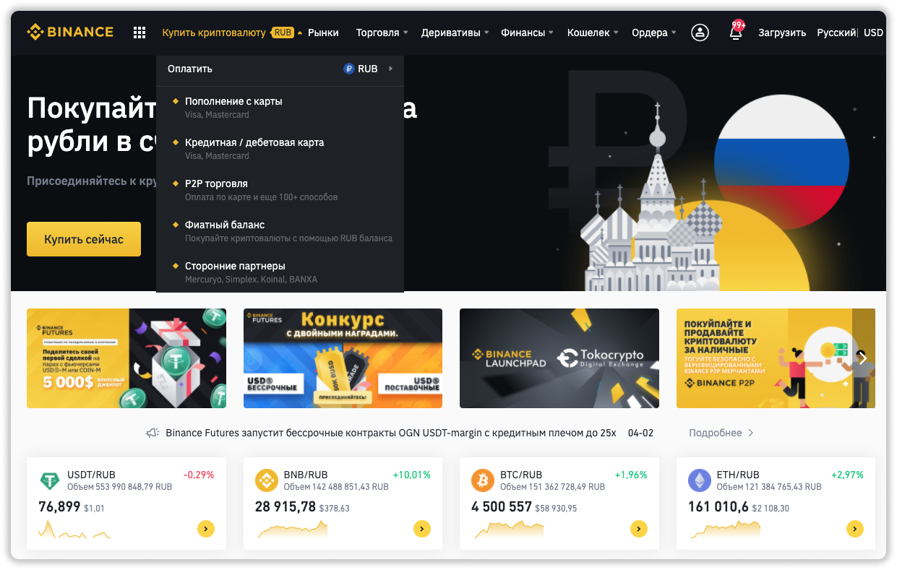
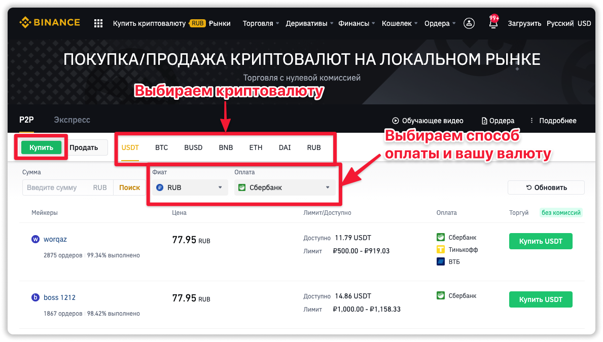
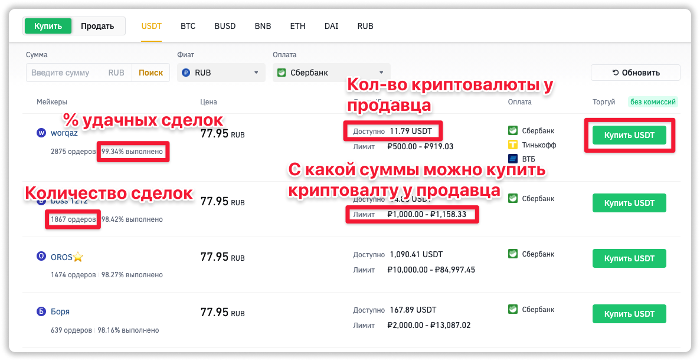
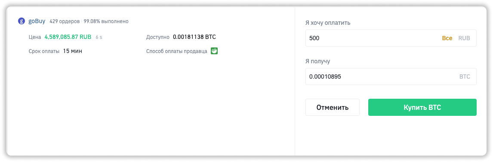
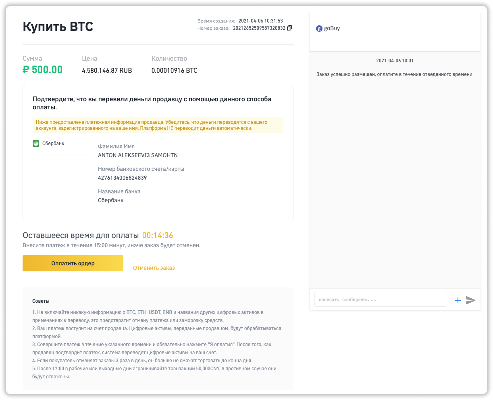
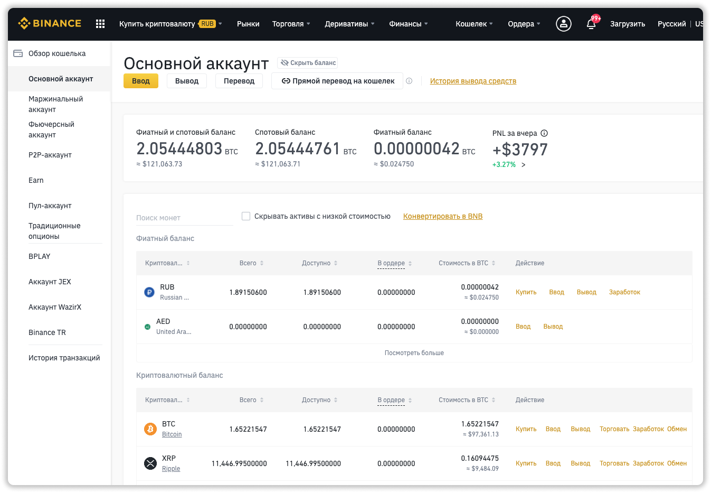

##❗️Мои каналы о крипте и хайпах:

📱 [Telegram](https://t.me/pyromidinvest) 
📺 [YouTube](https://www.youtube.com/channel/UCc7s-9Ki7Is7YbCPpWzPcFw) 
🤳 [Instagram](https://instagram.com/pyromidi)
***

Данный метод удобен тем, что в нем нет ограничений по покупке криптовалюты в месяц, в отличие от [метода №1](/kupit-crypto-na-binance-s-karty/). Внимательно смотрите инструкцию, так как покупка на p2p требует большей внимательности. 

## Что потребуется для покупки через p2p Binance?
***

1) Быть [зарегистрированным](https://www.binance.com/ru/register?ref=21175927) в бирже binance
2) Пройти [верификацию](https://pyromid.ru/verifikaciya-binance/) личности и адреса
3) Иметь дебетовую карту любого банка

## Шаг 1: заходим в раздел покупки
***

**1.1** Авторизируетесь на binance.

**1.2** В меню выбираете пункт **Купить криптовалюту** → **P2P торговля**.

## Шаг 2: выбираем криптовалюту и продавца
***

**2.1** Выбираете пункт **Купить**.

**2.2** Выбираете криптовалюту, которую хотите купить в боковом меню.

**2.3** Выбираете способ оплаты и вашу национальную валюту.

**2.4** Выбираете продавца из списка. Смотрите у кого выгоднее, у кого достаточно криптовалюты, хороший рейтинг. Нажимаете кнопку **Купить**

## Шаг 3: оплата криптовалюты
***

Это самый ответственный шаг. Будьте очень внимательны!

**3.1** Вводите количество валюты, которую хотите купить. Нажимаете кнопку **Купить**. Обратите внимание на срок оплаты от продавца, на указана в форме левее.

**3.2** Вам необходимо перевести по указанным реквизитам деньги со своей банковской карты. И нажать **Оплатить ордер**. После этого в течение времени, указанного на экране, продавец подтвердит оплату и переведет вам криптовалюту на внутренний счёт в binance. 

❗️Если вы не нажмете **Оплатить ордер**, то вернуть деньги будет не так-то просто. Придется связываться с продавцом, он будет искать ваш перевод. Обычно это затягивается на 2-3 дня.

 

## Шаг 4: проверяем свой баланс
***

Купленная криптовалюта может отобразиться в двух разделах. В **Фиат и спот** или **P2P кошелек**. Ниже инструкция для проверки.

### Проверяем кошелек Фиат и спот

**4.1** Заходим в меню **Кошелек** → **Фиат и спот**.

**4.2** Ищем в списке криптовалют купленную вами. В столбце **Доступно** появятся купленное вами количество криптовалюты. 

**4.3** Далее можете вывести криптовалюту нажав на кнопку **Вывод**.

### Проверяем P2P кошелек

**4.4** Заходим в меню **Кошелек** → **P2P кошелек**.

**4.5** Нажимаете сверху "глаз", чтобы видеть свои средства.

**4.6** Находите купленную криптовалюту и переводим её в кошелек **Фиат и спот**. Так как выводить средства можно только с **Фиат и спот**.

**4.6** Всё. Возвращаетесь в этой инструкции к шагу **4.2**, если вам нужно вывести криптовалюту в какой-то проект или на внешний кошелек.

## Частые проблемы с P2P от Binance?
***

**1.** Вы забыли после оплаты нажать кнопку **Оплатить ордер**. Теперь вам придется разбираться с продавцом напрямую через чат.

**2.** Маловероятно, но продавец может не отправить криптовалюту. Тогда смело нажимайте **Апелляция** и Binance. Binance проверит этот ордер, попросит вас подтвердить оплату и вернет вам деньги. Апелляция занимает от 1 до 7 суток. 

**3.** Вы ошиблись с реквизитами и перевели не тому человеку. Увы, тут сделать ничего нельзя. Нужно быть внимательным.. 

## Не нашли ответ на вопрос?
***
Смело пишите мне в [Telegram](https://t.me/girlwithbun). Постараюсь помочь с покупкой криптовалюты. А благодарностью за это, будет круто, если вы подпишитесь на мой [канал в Telegram PYROMID](https://t.me/pyromidinvest), там я даю крутую информацию по криптовалюте.
