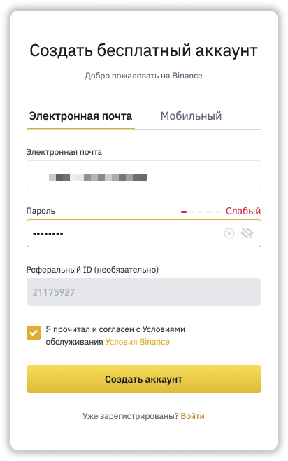

### ❓ Если возникнут вопросы → **[Telegram](https://t.me/girlwithbun)**
### 📲 Моя группа в Telegram → **[Telegram](https://t.me/pyromidinvest)**
***

Регистрация на Binance проходит в пару простых этапах. Первое - это сама регистрация, а второе - верификация на Binance. Если у вас вопросы, пишите мне в Telegram. Больше информации есть в моей группе [Telegram](https://t.me/pyromidinvest), [Instagram](http://instagram.com/pyromidi) или на канале [YouTube](https://www.youtube.com/channel/UCc7s-9Ki7Is7YbCPpWzPcFw).

## Шаг 1: регистрируемся по ссылке на Binance
***

Переходим по **[ссылке для регистрации](https://www.binance.com/ru/register?ref=21175927)** на официальном сайте Binance.com.

## Шаг 2: заполняем форму регистрации

Заполняем форму регистрации. Вашу почту и пароль. Пароль обязательно установите надежный!

## Шаг 3: проходим верификацию на Binance

Пройдя верификацию вы увеличите лимиты на вывод. Вот пошаговая **[инструкция по верификации на Binance](/verifikaciya-binance/)**.

## Что дальше?

**1.** Научитесь теперь покупать криптовалюту. У меня есть 2 инструкции. Вот [первая](https://pyromid.ru/kupit-crypto-na-binance-p2p/) и вот [вторая](https://pyromid.ru/kupit-crypto-na-binance-s-karty/).

**2.** Научитесь выводить деньги и криптовалюту себе на карту. Вот готовая инструкция ["Как вывести деньги с Binance на карту банка"](https://pyromid.ru/kak-vivesti-dengi-s-binance/).

**3.** Научитесь торговать на бирже. Но это уже самообучение. Если у вас есть вопросы, вступайте в [группу Telegram](https://t.me/pyromidinvest) или пишите [мне личку](https://t.me/girlwithbun).

## Почему некоторым людям и странам запрещена регистрации на Binance?
***

**1.** Вы или кто-то за вас уже повторно регистрировался на бирже Binance. А создавать несколько профилей - не допустимо. Нужно написать в техподдержку и решить этот вопрос. 

**2.** В некоторых странах запрещена регистрация на Binance. Вы сможете активировать VPN, но не сможете пройти верификацию. Попробовать все равно стоит. Или написать в поддержку - она на 100% даст достоверный ответ. 

***
### Полезные инструкции
[Как зарегистрироваться на бирже Binance](https://pyromid.ru/registraciya-binance/)

[Как пройти верификацию на Binance](https://pyromid.ru/verifikaciya-binance/)

[Как купить криптовалюту на Binance через P2P](https://pyromid.ru/kupit-crypto-na-binance-p2p/)

[Как купить криптовалюту на Binance с банковской карты](https://pyromid.ru/kupit-crypto-na-binance-s-karty/)

[Как вывести деньги на карту через Binance](https://pyromid.ru/kak-vivesti-dengi-s-binance/)

***
