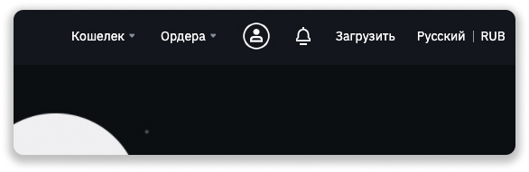
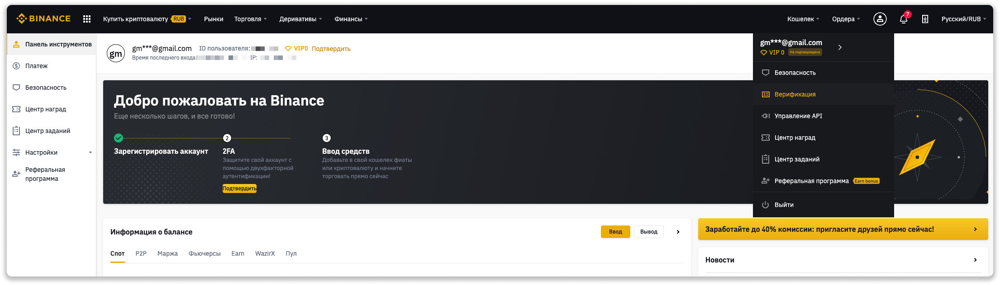
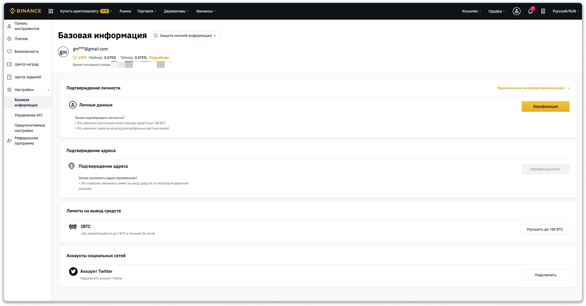
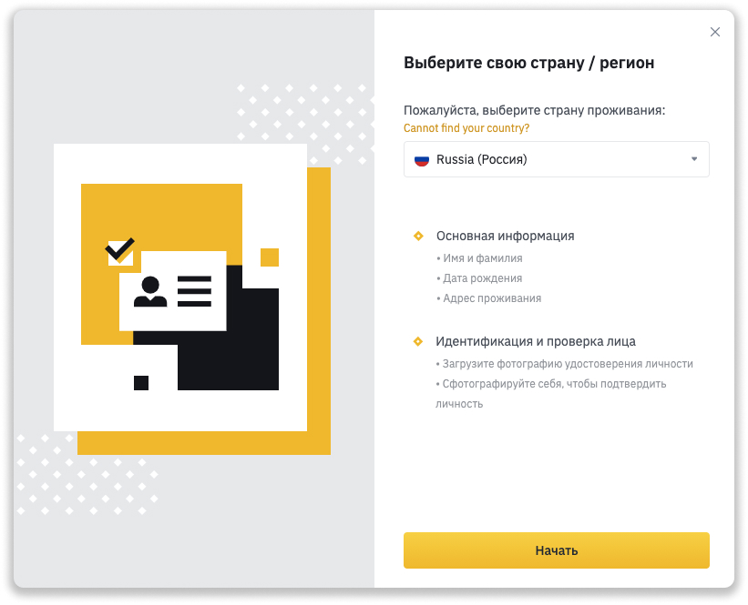
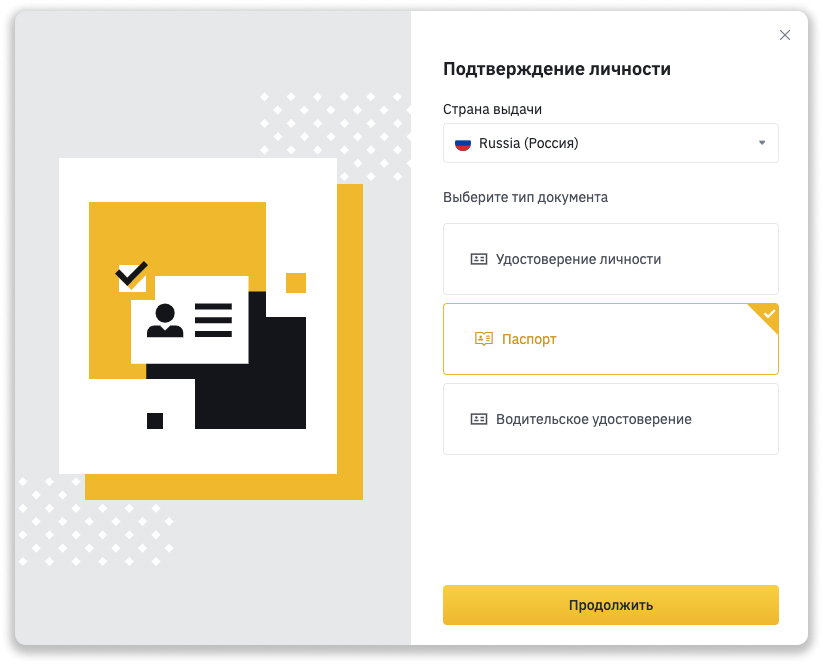
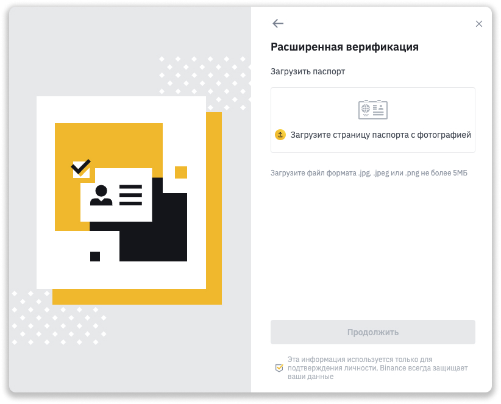
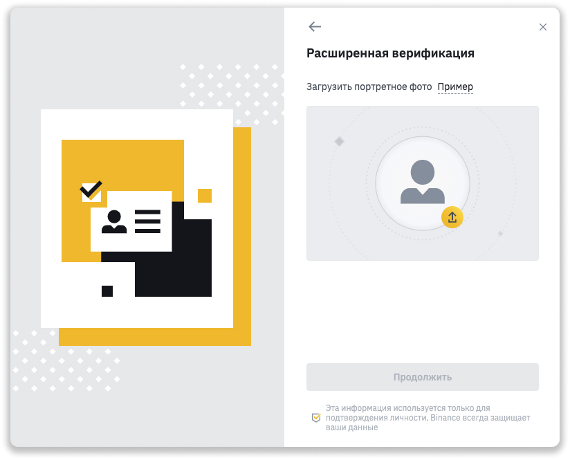
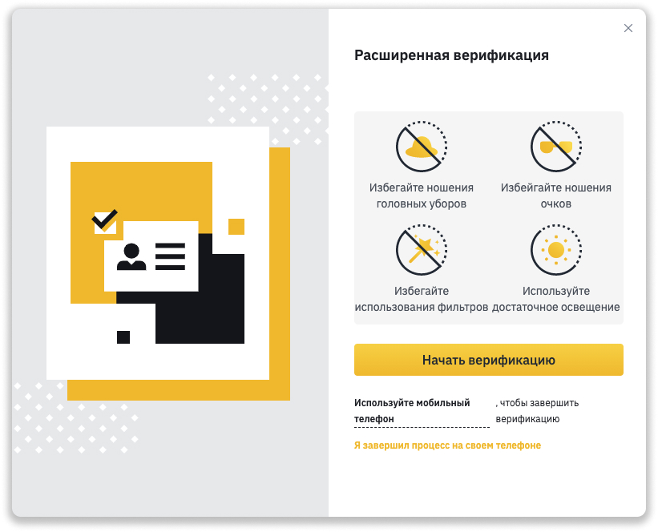
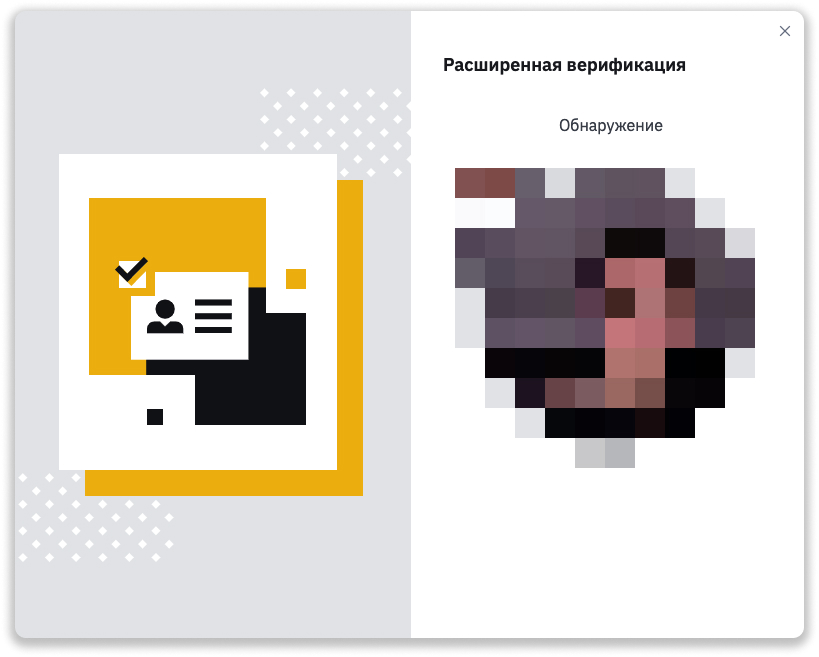

### ❗️Мои каналы о крипте и хайпах: 
📱 [Telegram](https://t.me/pyromidinvest) 
📺 [YouTube](https://www.youtube.com/channel/UCc7s-9Ki7Is7YbCPpWzPcFw) 
🤳 [Instagram](https://instagram.com/pyromidi)
***

Верификация на бирже [binance.com](http://binance.com) занимает 1-2 дня, если вы верно подали все данные. В инструкции отвечу на вопросы:

- Зачем нужна верификация
- Как верифицироваться
- Частые ошибки верификации
- Вывод и пополнение без верификации
- Есть ли разница верификации в Европе, Украине, России и других странах

***

❗️ Если ответа на вопрос нет, пишите [лично мне](https://t.me/girlwithbun).

***

## Зачем нужна верификация на бирже [binance.com](http://binance.com)?
***
Если вы верифицируетесь на бирже, то получите следующие привелегии:

- Сможете покупать криптовалюту прямо с кредитной карты
- Сможете выводить доллары, рубли или другие фиатные средства на свой счёт в банке или свою банковскую карту
- Сможете выводить с биржи Binance до 100 BTC в сутки (24 часа)

## 🧔👩‍🦰 Как верифицировать свой аккаунт на binance?
***

### Шаг 1: Наводите на иконку "человека" в правом верхнем углу

### Шаг 2: Нажимаем кнопку "Верификация"

### Шаг 3: Нажимаем кнопку "Верифицироваться" у пункта "Личные данные"

### Шаг 4: Выбираете вашу страну проживания

### Шаг 4: Выбираете как хотите подтвердить вашу личности

Разницы нет. В этом примере выбираю паспорт.

### Шаг 5: Загружаете фото вашего первого разворота паспорта

**Внимание**: не должно быть бликов, не допускается фото паспорта в обложке или обрезанные углы. Нельзя размещать посторонние предметы на фото.

### Шаг 6: Загружаете свой портрет

Без головных уборов, очков, маски.

### Шаг 7: Проходите расширенную верификацию [обязательно]

Для этого вам потребуется, чтобы у компьютера была веб-камера. Нажимаем **Начать верификацию**

Если веб-камеры нету, то скачайте приложение Binance на телефон. Авторизируйтесь в нем. Наведите камеру на QR код, который отобразится на компьютере.

### Шаг 8: Верифицировать лицо

Что на компьютере, что на телефоне включится камера. Там будут подсказки что делать. Вращать лицом, моргнуть, повернуть лицо в профиль и так далее. Следуйте этим подсказкам.

Готово, ожидайте верификацию 1-2 дня. На ваш email придёт письмо об успешной верификации или отказе.

## Частые ошибки верификации на Binance
***
1. Загрузили плохое изображение документа удостоверяющего личность. Не должно быть бликов на фото, фотография должна быть четкой и все элементы читаемы, не должно быть посторонних предметов, обложек, рук. Документ должен полностью влезать в фотографию, не быть обрезанным.
2. Загрузить портрет НЕ лица, портрет с головным убором, очками, маски или другие предметы, которые закрывают лицо
3. При расширенной верификации не хватает света в помещении, чтобы идентефицировать ваше лицо.
4. Данные при регистрации не совпадают с данными в паспорте: ФИО, дата регистрации и другая информация.
5. Верификация прошла успешно, но при покупке криптовалюты просит верифицировать. Это глюк binance. Решить может проблему только поддержка. Пишите в чат.
6. После прохождения верификации не увеличился лимит на покупку криптовалюты. Тут 2 решения проблемы, написать в поддержку. Или оставить заявку на расширение лимитов по [ссылке](https://docs.google.com/forms/d/e/1FAIpQLSfv0XXLUr9XDkEu_2EoGHRUegorPqGJbQv93ZfdwhX21kmFRg/viewform). Заявку рассматривают в течении 7 дней.

## Разница верификации для России, Украины, Европы
***
Требования для всех стран одинаковые. Инструкция по регистрации в России или Украине ничем не отличается от верификации в Европе или Западе.

## Не нашли ответ на вопрос?
***
Смело пишите мне в [Telegram](https://t.me/girlwithbun). Помогу разобраться с ошибкой. Пожалуйста, задавайте свой вопрос в точной форме. Опишите проблему, приложите скрин-шоты. Тогда я отвечу вам более развернуто и буду полезен.
