### ❗️Мои каналы о крипте и хайпах: 
📱 [Telegram](https://t.me/pyromidinvest) 
📺 [YouTube](https://www.youtube.com/channel/UCc7s-9Ki7Is7YbCPpWzPcFw) 
🤳 [Instagram](https://instagram.com/pyromidi)
***

## Оглавление
➖[Как вывести деньги с Binance через P2P на карту?](#как-вывести-с-binance-через-p2p-на-карту)

➖[Как выводить деньги напрямую с Binance на карту банка?](#как-выводить-деньги-напрямую-с-binance-на-карту-банка)

Ниже я опишу два способа по выводу денег с Binance на карту любого банка. Не важно, выводите вы рубли, гривны, тенге, доллары или евро - действия будут абсолютно одинаковые. У каждого способа есть плюсы и минусы. Я лично сам пользуюсь **P2P**. 

## Как вывести деньги с Binance через P2P на карту? 
***

Данный способ подразумевает обмен между пользователями внутри Binance. Способ полностью безопасный и страхуется биржей на 100%. Плюс - нет комиссии. Минус - если человек пропал, Binance возвращает деньги в течении 2 суток.

### Шаг 1: регистрируемся на binance

Если вы не зарегистрированы на бирже Binance, вот подробная инструкция **[Как зарегистрироваться на Binance**](/registraciya-binance/).

### Шаг 2: пройти верификацию

Пройдя верификацию вы увеличите лимиты на вывод. Так что воспользуйтесь этой **[инструкцией и верифицируйтесь](/verifikaciya-binance/)**.

### Шаг 3: Привязывайте карту для вывода денег с Binance

Вы можетие привязать несколько карт. Просто проделайте этот пункт несколько раз. 

**3.1** Наводим на иконку человечка в навигации и нажимаем на пункт с вашей электронной почтой.

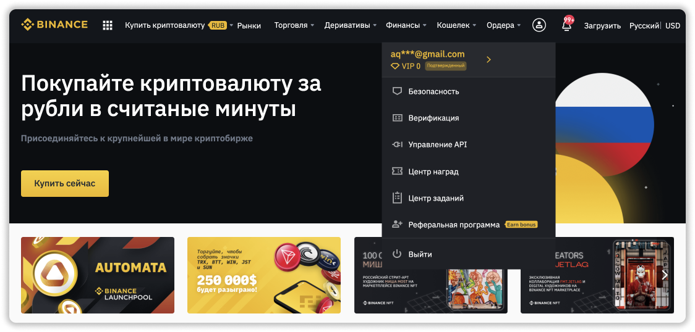

**3.2** Выбираем пункт **Платежи** в левом меню.

**3.3** Далее выбираете вкладку **P2P** и нажимаете кнопку **Добавить способ оплаты**.

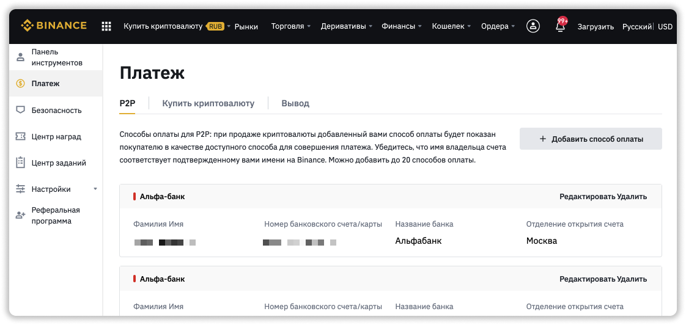

**3.4** Тут уже на ваше усмотрение. Выбираете куда хотите переводить деньги. Можно сделать вывод с Binance на Сбербанк, Tinkoff, Альфабанк или на электронные кошельки.

**3.5** Я выбрал вывод рублей с Binance на Сбербанк для примера. Заполняем 3 пункта: Номер банковского счета/карты, Название банка и Отделение открытия счета.

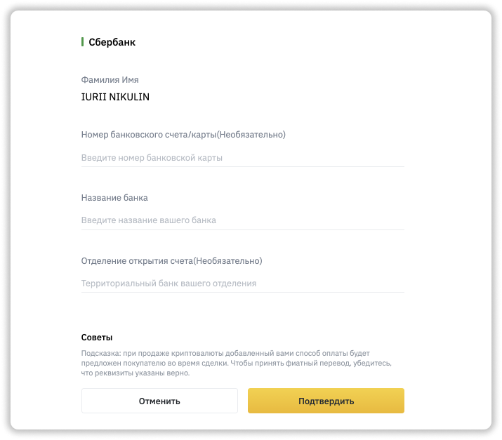

### Шаг 4: выводим с Binance на карту банка

Это финальный шаг и будьте внимательными. Через минут 20 вы уже получите деньги с биржи Binance на банковскую карту, в нашем примере - это на Сбербанк.

**4.1** Переводим свою криптовалюту в P2P кошелек. Нажимаем в меню **Кошелек** → **P2P кошелек**.

**4.2** Напротив вашей криптовалюты нажимаем **Перевод**.

**4.3** Выбираем из **Фиат и спот** в **P2P**, вводим сумму и нажимаем **Подтвердить**.

**4.4** Заходим через верхнюю навигацию в **Купить криптовалюту** → **P2P торговля**.

**4.5** Нажимаем **Продать** и выбираем вашу криптовалюту для продажи.

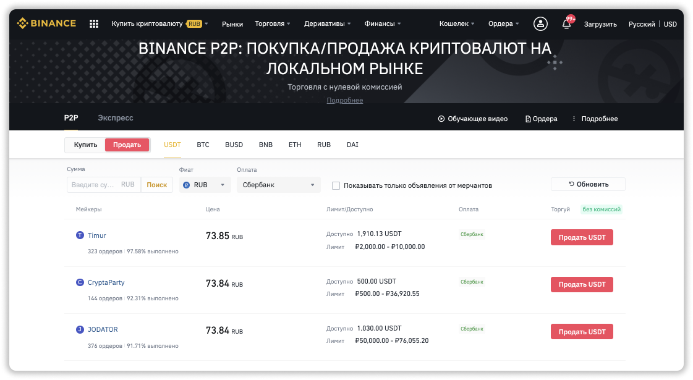

**4.6** Теперь выбираем подходящего покупателя для вашей криптовалюты и нажимаем на против него **Продать**. Не забудьте выбрать вашу валюту страны и банк.

**4.7** Вводим сумму для продажи и нажимаем **Продать**.

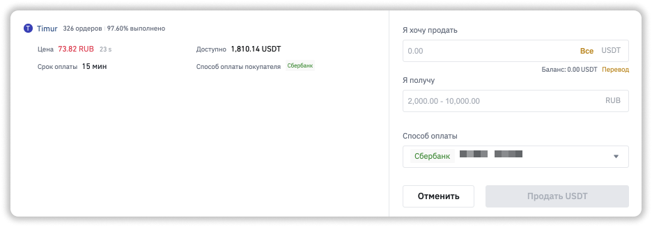

**4.8** Дожидаемся 5-20 минут, пока человек переведет вам деньги на вашу карту, в нашем случае на Сбербанк. Только после этого нажимаем кнопку **Подтвердить перевод**

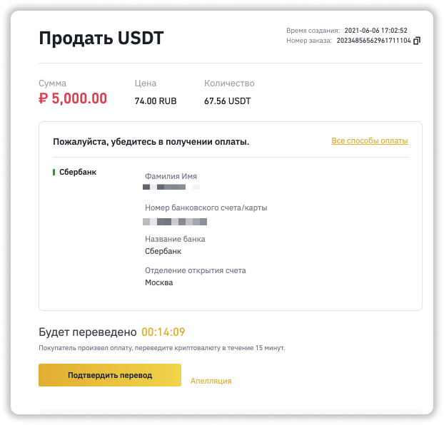

## Как выводить деньги напрямую с Binance на карту банка? 
***

В данном способе сама биржа Binance делает вывод фиатных средств на вашу карту. Плюс - нет посредников, транзакция происходит в 100% случае. Минус - повышенная комиссия на вывод денег с Binance на карту.

### Шаг 1: меняем криптовалюту на фиатные деньги

**1.1** Заходим в верхней навигации  **Кошелек** → **Фиат и спот**.

**1.2** Напротив вашей криптовалюты нажимаем **Торговать** и выбираем нужную пару. В моем случае **USDT/RUB**.

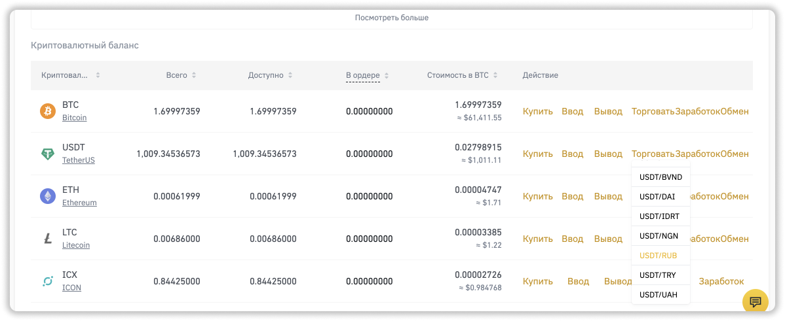

**1.3** Меняем вашу криптовалюту. Ставим цену чуть ниже рыночной, вводим количество и нажимаем **Продать**.

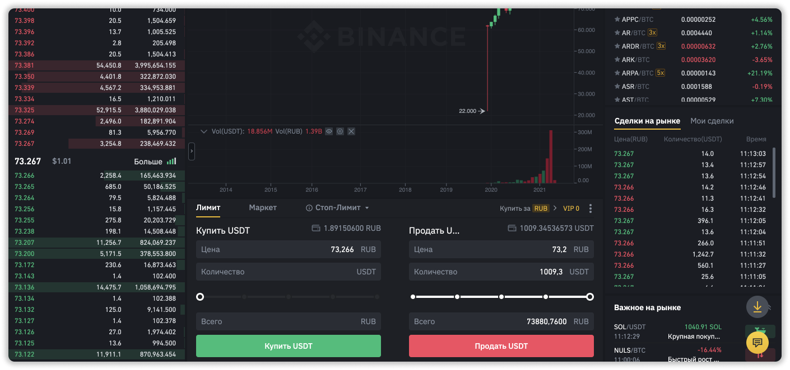

**1.4** Идем опять в раздел **Кошелек** → **Фиат и спот** и нажимаем кнопку вывода напротив вашей валюты, в моем случае это RUB.

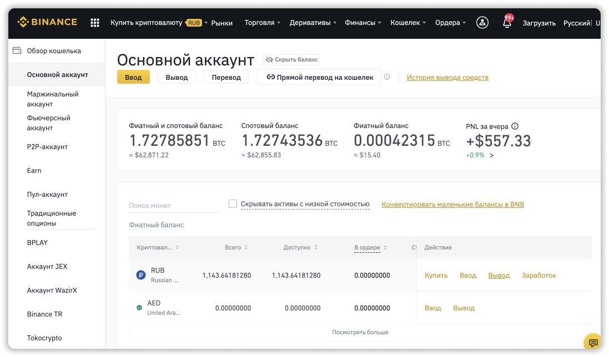

**1.5** Выбираем способ вывода **Карта (Visa / Mastercard)**, вводим количество, добавляем вашу карту и нажимаем **Продолжить**.

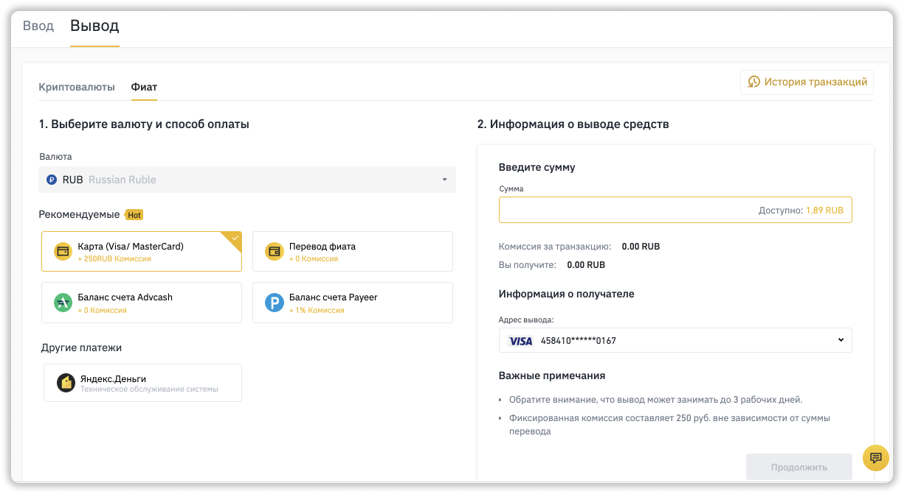

**1.6** Подтверждаем и ожидаем сумму на карте в течении 30 минут. 

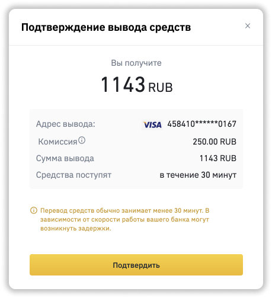

## Частые проблемы с выводами денег с Binance?
***

**1.** Продавец произвел плату через P2P, но деньги на карту не пришли. Решение: подождать еще 10 минут, если денег нет - то нажать кнопку апелляция и приложить все доказательства. Поддержка разберется в течении 2 дней.

**2.** Не верно указали карту. В данном случаем вернуть деньги не получится.

**3.** При выводе денег с Binance нет пункта **Карта (Visa / Mastercard)**. В таком случае придется воспользоваться выводом P2P.  

## Не нашли ответ на вопрос?
***

Коротко и четко отвечаю на вопросы в группе [Telegram](https://t.me/pyromidinvest) или в [Instagram](http://instagram.com/pyromidi). А так же, много видео по криптовалютам и хайпам на моем [YouTube](https://www.youtube.com/channel/UCc7s-9Ki7Is7YbCPpWzPcFw). Смело пишите мне в [Telegram](https://t.me/girlwithbun), если не нашли ответ на вопрос.

***
### Полезные инструкции
[Как зарегистрироваться на бирже Binance](https://pyromid.ru/registraciya-binance/)

[Как пройти верификацию на Binance](https://pyromid.ru/verifikaciya-binance/)

[Как купить криптовалюту на Binance через P2P](https://pyromid.ru/kupit-crypto-na-binance-p2p/)

[Как купить криптовалюту на Binance с банковской карты](https://pyromid.ru/kupit-crypto-na-binance-s-karty/)

***
