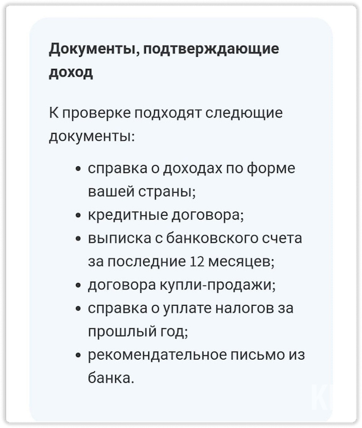
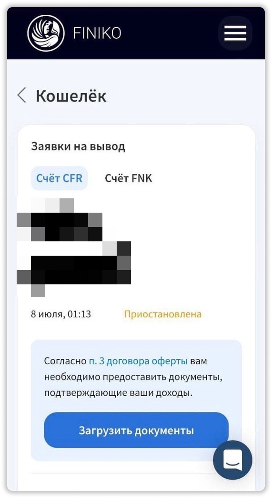
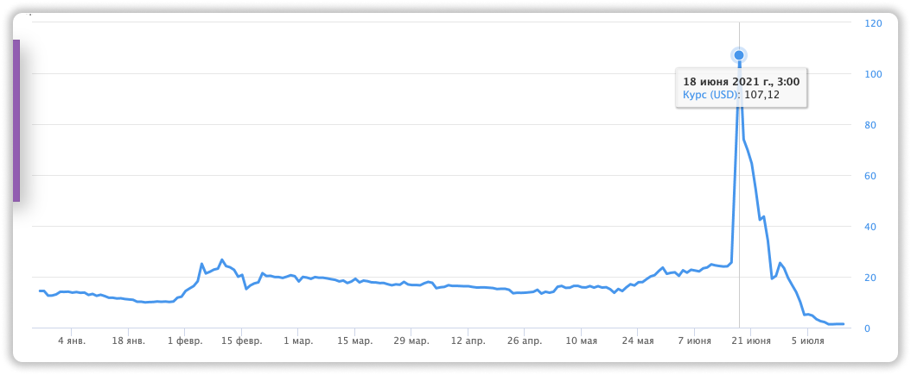
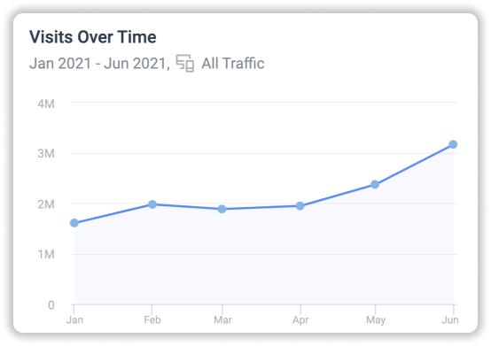
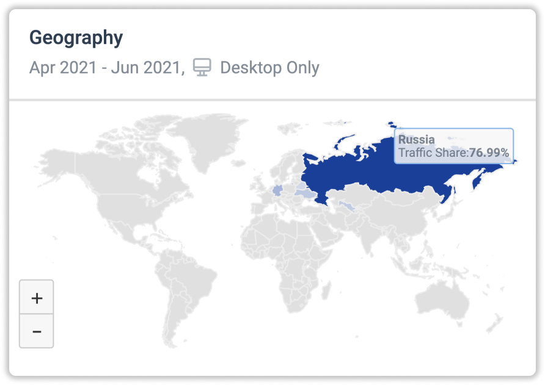

### ❗️ Больше информафции в моей → **[группе Telegram](https://t.me/pyromidinvest)**
***

Наверное новость о скаме проекта Финико — сейчас самая важная. Стоит ли опасаться вкладчикам, которым приостановили выплаты? Ниже в статье подробно разберем, почему скам еще был ясен пару в начале этого года. Если есть вопросы, пишите мне в личку **[Telegram](https://t.me/girlwithbun)**, **[Instagram](https://instagram.com/pyromidi)** или подписывайтесь на **[YouTube](https://www.youtube.com/channel/UCc7s-9Ki7Is7YbCPpWzPcFw)**.

## Что произошло с Финико 13 июля 2021 года?
***

Организация стала требоваать подтверждения о законности доходов. Но условия крайне не выполнимые. На данном этапе Финико просит следующие документы:

- Справка о доходах
- Кредитный договор (если брали кредит)
- Выписка с банковского счёта за 12 месяцев
- Договор купли-продажи (если вы что-то продали для вклада в Финико)
- Справка об уплате налогов, которые вы делали получая доход с проекта
- Рекомендательное письмо из банка

Люди конечно же в шоке после краха Финико и не понимают где взять эти справки. Сейчас многие напрягают банки и подделывают справки.

❗️Кстати, Финико не имеет законного основания запрашивать такие документы, так как не является финансовой организацией в РФ.

## Что делать вкладчикам Finiko и какие шаги предпринимать?
***

Вам реально придётся достать эти документы. Другой вопрос, можно их подделать и никто ничего вам не скажет. Важно как можно быстрее отправить их в первых редях, так как люди массово начнут отправлять свои документы. И срок проверки может затянуться на недели и даже месяцы. 

Откуда взять документы для подтверждения дохода в Финико, я конечно же вам не подскажу. Моё мнение, пройдут верификацию не многие. Финико плавно скамится. Мой совет на будущее, заходить в подобные проекты при старте, тогда вы всегда заработаете деньги. О новых проектах я даю информацию у себя в **[Telegram канале](https://t.me/pyromidinvest)**.

## Было ясно о скаме Финико давно!
***

Как только проект ввел свои токены FNK 27 декабря 2020 года, это был первый сигнал скама. С помощью этого токена они манипулировали и большинство людей потеряли до 79% своих сбережений. Проект прожил еще пол года. 

Этими токенами они продлили жизнь проекта конечно же, но ничто не вечно. Нагрузка была настолько высока, что пришлось вводить подтверждение дохода. Этими действиями они не позволят подтвердить доход у мульти-аккаунтах. 

## Немного о развитии проекта Финико
***

Если смотреть по количеству вкладчиков, то количество росло каждый месяц. Другой вопрос, были ли вклады больше, чем выводы из проекта. Кажется что нет, так как зачем скамить проект, когда он приносит доход?

За последние пол года, количество посетителей проекта увеличилось в 2 раза. До 3,1 млн. 

И не для кого ни секрет, что проект был популярен только в России. Он забрал практически весь рынок. Самое интересное, что аудитория проекта в основном 45+.

## Отзыв о Финико
***

Хоть я уже давно не участвую в этом проекте, но он отработал на 5 с плюсом. Его можно поистине признать топовой пирамидой последних лет. Качественная организация, медийность. Да и заработать дала они десятки тысячам людей. Надеюсь в скором времени появится похожий проект. Если хотите об этом узнать первым, то подпишитесь на мою **[группу Telegram](https://t.me/pyromidinves)**. Там я даю новости оперативней.

***
### Полезные инструкции

[Telegram чат об инвестициях PYROMID](https://t.me/pyromidinvest)

[YouTube канал о заработке PYROMID](https://www.youtube.com/channel/UCc7s-9Ki7Is7YbCPpWzPcFw)

***
