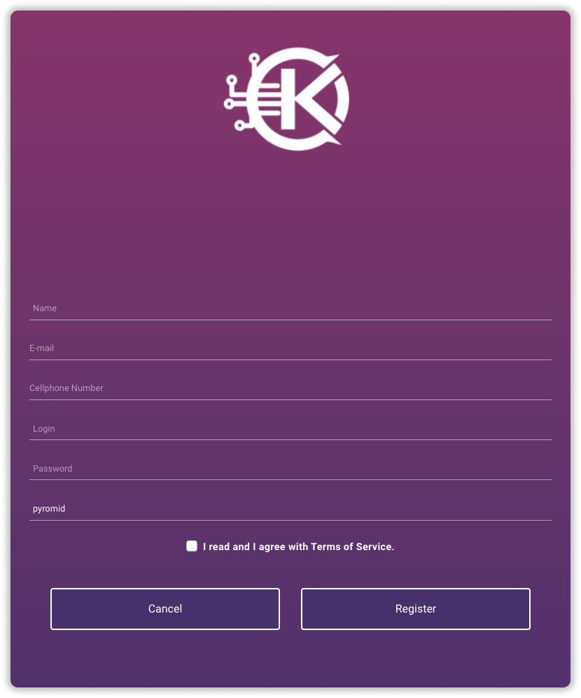
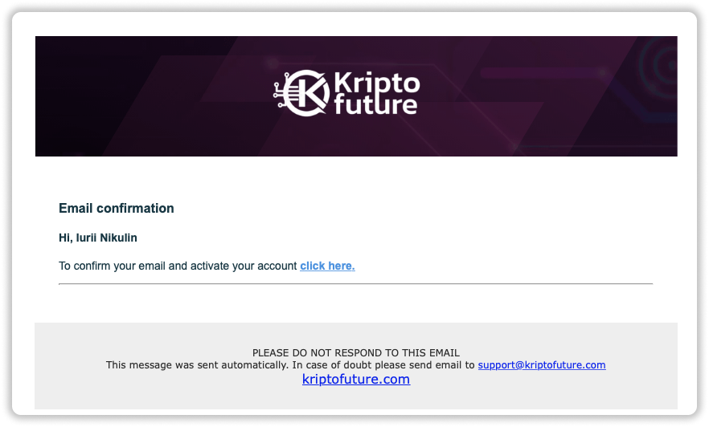
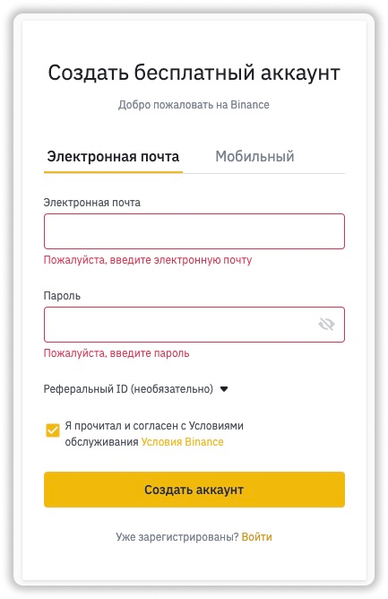
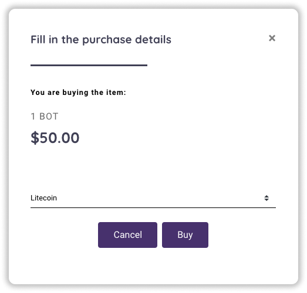
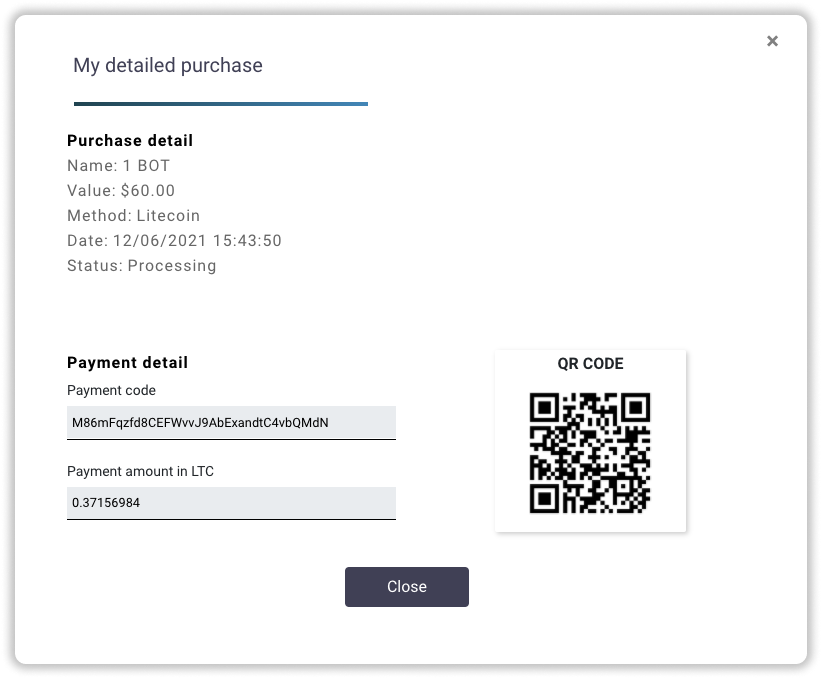
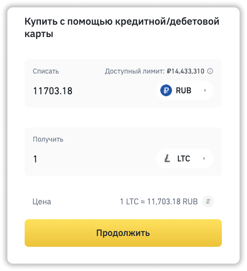
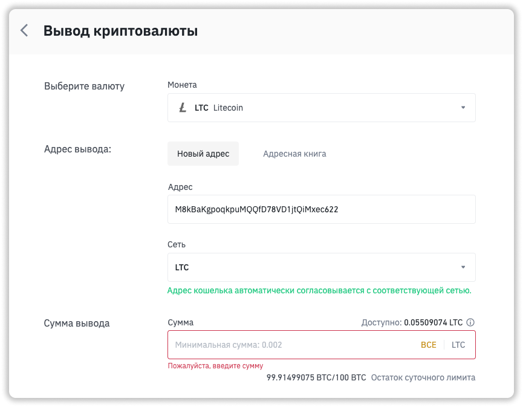
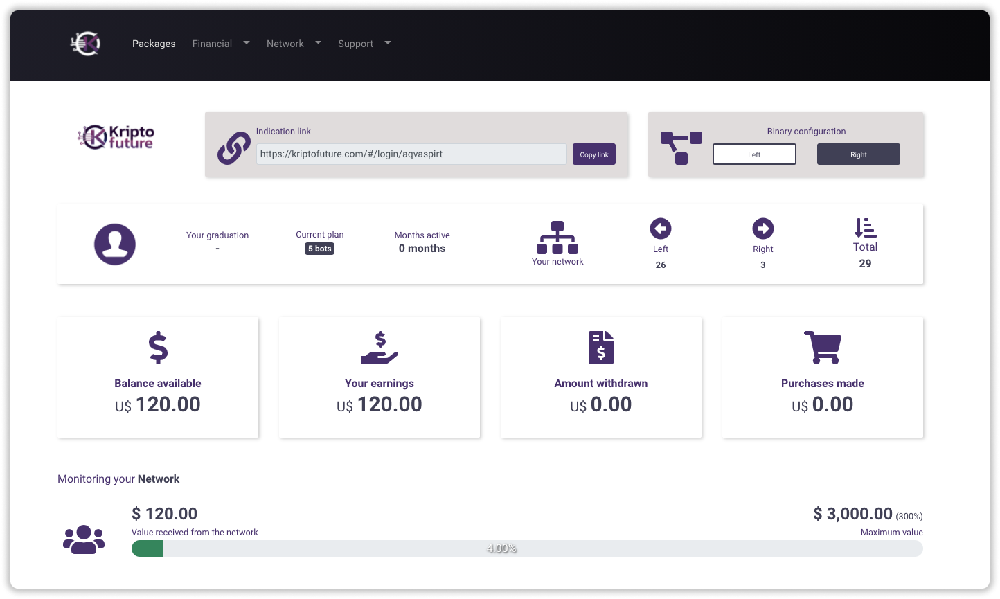

### ❓ Если возникнут вопросы → **[Telegram](https://t.me/girlwithbun)**

📱 [Telegram](https://t.me/pyromidinvest) 
📺 [YouTube](https://www.youtube.com/channel/UCc7s-9Ki7Is7YbCPpWzPcFw) 
🤳 [Instagram](https://instagram.com/pyromidi)
***

## Шаг 1: Регистрируемся в Kripto Future
***

**1.1** Переходим по ссылке, регистрируемся - [https://kriptofuture.com/#/login/pyromid](https://kriptofuture.com/#/login/pyromid) и заполняем все поля. Потом нажимаем **Register**

**1.2** На электронную почту придет письмо с подтверждением. Нужно нажать фразу **click here**. 

❗️Код подтверждение может прийти в папку **спам**.

## Шаг 2: Регистрируемся на Binance
***

❗️**Этот шаг можно пропустить если у вас есть binance или вы сами знаете откуда вам проще перевести деньги в проект.**

Инвестиционный пакет покупается с помощью криптовалюты Bitcoin, Litecoin или Dogecoin.  В Litecoin или Dogecoin выгоднее всего, там комиссии минимальные и платеж проходит за 20-30 минут.

**2.1** Переходим по ссылке [binance.com](https://accounts.binance.com/ru/register) и регистрируемся.

**2.2** Проходите верификацию. Она занимает 1-2 дня.

Кликай, если нужна [Подробная инструкция по прохождению верификации на binance](/verifikaciya-binance/).

## Шаг 3: Делаем депозит в Kripto Future
***
В данном примере пополняем через биржу binance.com. Если у вас другой кошелек, скорее всего вы знаете как им пользоваться.

**3.1** Заходите в ваш личный кабинет Kripto Future и переходите в раздел **[Packages](https://kriptofuture.com/#/products)**

**3.2** Выбираете нужный вам инвестиционный пакет и нажимаете кнопку **Start**.

**3.3** Выбираем способ оплаты и нажимаем **Buy**.

**3.4** Появится окно оплаты. Будет написано сколько криптовалюты нужно перевести и на какой кошелёк.

❗️**Важно**: на одном аккаунте можно иметь только один инвестиционный пакет. Далее его можно только улучшать, добавляя необходимую сумму.

Пункты 3.5-3.8 можно пропустить, если у вас есть криптовалюта на бирже binance или вы сами знаете как её перевести в проект.

**3.5** Заходим на [binance.com](http://binance.com) и слева сверху нажимаем **Купить криптовалюту → Кредитная / Дебетовая карта**

**3.6** Выбираем вашу национальную валюту, у меня это RUB. Ниже выбираем LTC. Вводим то количество рублей, чтобы оно соответствовало нужному количеству криптовалюты. 

**Важно: купите с запасом на 1 000 рублей больше, так как будут комиссии при переводе.**

**3.7** Нажимаем на кнопку **Продолжить** и вводим данные банковской карты в форме.

**3.8** Подтверждаете покупку с помощью SMS и кода, который пришел на почту. Если транзакция отклонена, то нужно написать в поддержку, чтобы binance верифицировал вашу банковскую карту.

**3.9** Переходите в раздел **Кошелек → Фиат и спор**

**3.10** Напротив криптовалюты LTC нажимаете **Вывод**

**3.11** Вставляете кошелек из проекта Kripto Future. Выбираете сеть LTC, если переводите в Litecoin. Вводите количество LTC, которое требуется плюс комиссию, которая указывается ниже. И нажимаем **Отправить**. Вывод подтверждается SMS и кодом на вашу почту.

**3.12** Всё. После оплаты больше ничего делать не нужно. Деньги зачисляются от 20 минут до 1 часа. Терпение!

**3.13** Купленная лицензия отобразится в разделе на главной странице аккаунта.

## Полезные советы
➖ Если будете привлекать активно партнеров, то нужно активировать бинарный маркетинг. Нужно пригласить двух партнеров, одного в лево, другого в право на минимальные депозиты. Советую создать свои аккаунты и завести по 50$.

➖ Пополнять советую в Litcoin, приходит за 10 минут.

➖ Вначале пополняете свой аккаунт, а только потом приглашаете людей. Иначе потеряете бинарный и примой бонус.

***
### Полезные инструкции

[Как купить криптовалюту на Binance через P2P](https://pyromid.ru/kupit-crypto-na-binance-p2p/)

[Как купить криптовалюту на Binance через банковскую карту](https://pyromid.ru/kupit-crypto-na-binance-s-karty/)

[Инструкция по верификации на бирже Binance](https://pyromid.ru/verifikaciya-binance/)

***
