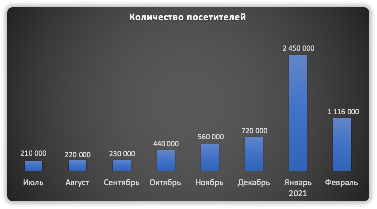
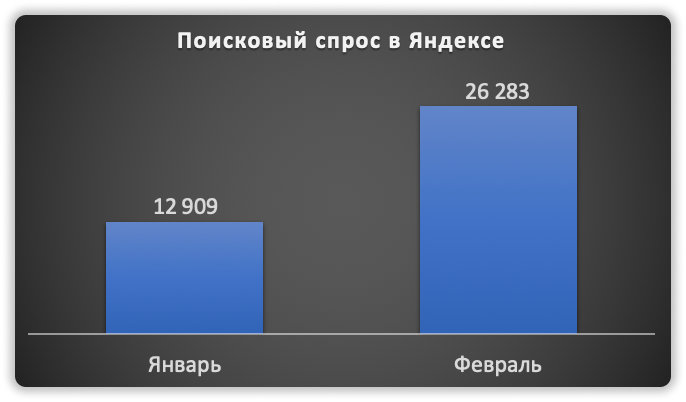
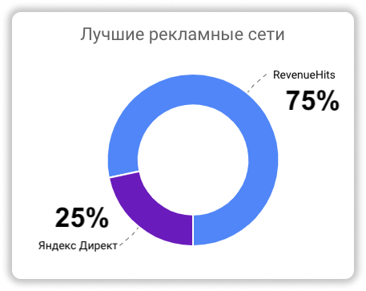
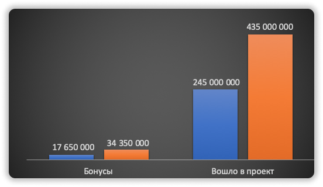
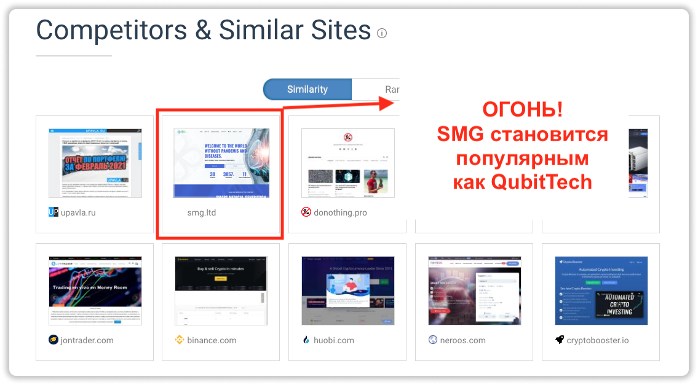

### ❓ Если возникнут вопросы → **[Telegram](https://t.me/girlwithbun)**
***

Продолжение моей крутой рубрики по анализу проекта QubitTech (Qubit Life). Этот анализ удалось сделать с трудом, так как проект переезжал с домена на домен. Было тяжело сопоставить данные и сделать всё развернуто. Если вы не смотрели анализ за [январь 2021, то вот он](https://pyromid.ru/analytika-qubittech-yanvar/).

## Посетители Qubit Life за февраль 2021
***

Количество посетителей упало в 2 раза по сравнению с январем. На февраль 2021 в проекте 1,16 млн посетителей. По правде, количество посетителей должно быть реально меньше, так как в новый год люди несли больше денег, чем в феврале.

## Популярность проекта в поисковых системах
***

Не удалось собрать статистику по Google, но зато по Яндексу смог! По сравнению с январем проект стал популярнее в 2 раза. Почему тогда посетители упали, а в Яндексе количество запрос в месяц говорят об обратном? ХЗ, скажите спасибо кубику что меняет домены, еще бы 2 раз ребрендинг сделали 😂

## Какая рекламная площадка больше всего рекламирует Qubit Life?
***

Есть такая площадка, как RevenueHits. С нее за последний месяц пришло колоссальное количество пользователей. Эта площадка заграничная, я ей лично не пользовался, но вижу что маркетологи подтягиваются! Круто! Яндекс Директ занимает тоже большую долю, 25%. В основном яндексом пользуются в СНГ.

## Сколько денег заработал Qubit Life за февраль
***

За февраль 2021 Qubit Life (QubitTech) заработал 435 млн долларов. Просто вах! Ниже график, где я показываю сколько было за январь. Разница в 1,5 раза! По бонусам, Кубик выплатил людям 34 млн долларов за февраль.

## QubitLife = Smart Medical Generation
***

В своей аналитической системе увидел корреляцию, что проект Qubit Life и Smart Medical Generation имют схожие параметры по поведению пользователей и трендам. А это значит, что нейросеть построила связи, что проекты схожи по своим посетителям и тренды развития. Думаю SMG сможет стать проектом 2021 года! Если кто не слышал про него, то [вот ссылка](https://pyromid.ru/obzor-proekta-smg-ltd/).

## Моё мнение и итоги по QubitTech (Qubit Life)
***

Проект Qubit Life живее всех живых. Я лично вкладываю до июля-августа этого года, потом начинаю тщательно анализировать и смотреть на проект. Проект пытается продлить срок жизни, так как урезает бонусы лидерам по маркетингу, тем самым давая заработать обычным вкладчикам в проекте. На данный момент по проекту всё ок! 

***
### Полезные инструкции
[Анализ Qubit Life за январь 2021](https://pyromid.ru/analytika-qubittech-yanvar/)

[Мой отзыв о QubitTech](https://pyromid.ru/vivod-s-qubittech/)

[Как инвестировать в QubitTech?](https://pyromid.ru/registraciya-popolnenie-qubittech/)

[Сколько я заработал в проекта](https://pyromid.ru/razvod-qubittech/)

***
