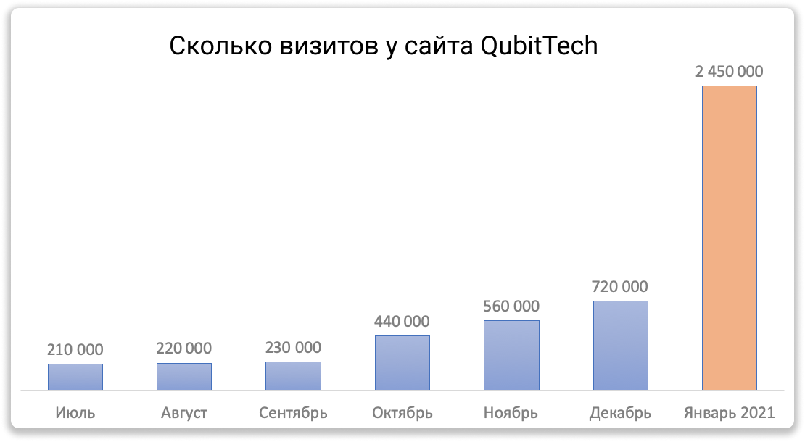
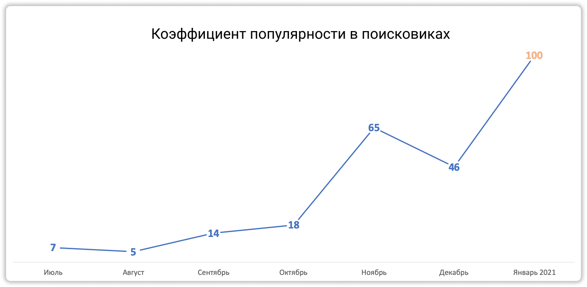
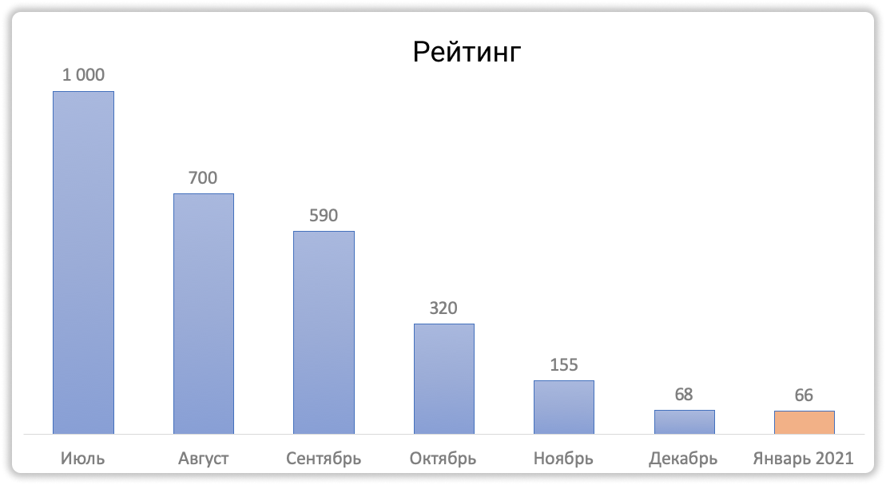
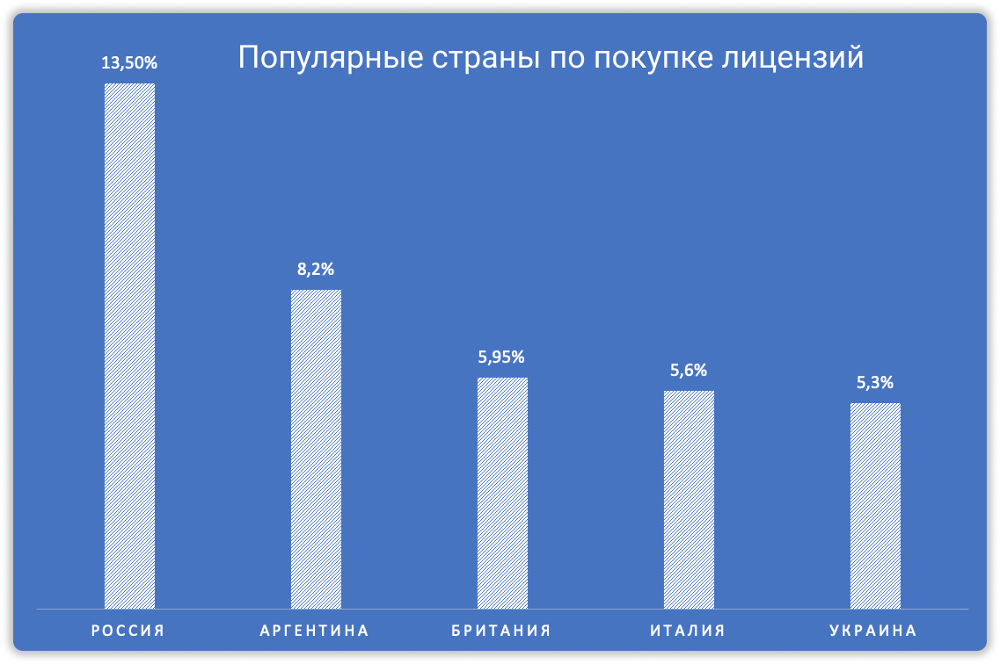
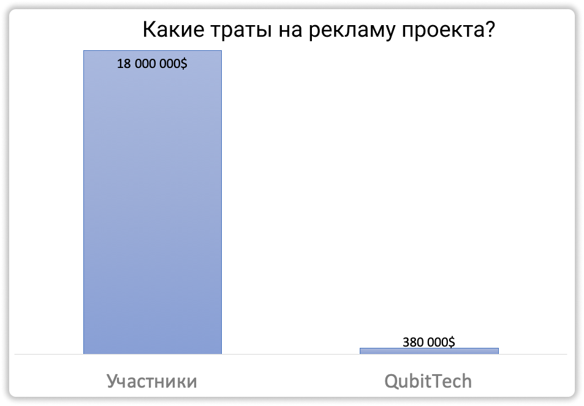
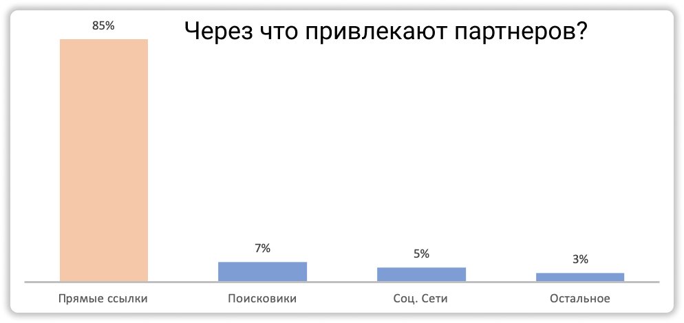
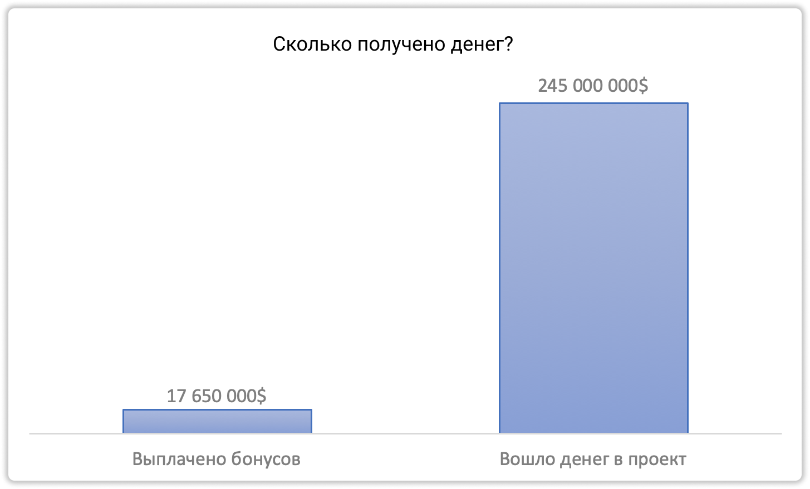

### ❓ Если возникнут вопросы → **[Telegram](https://t.me/girlwithbun)**
### 🎥 [Видео-аналитика в конце статьи](#аналитика-кубика-за-январь)
***

Это новая рубрика по аналитике QubitTech. Буду рассказывать подробно, сколько денег в проекте, как он рекламируется, сколько там пользователей. Ну и самое главное - буду предупреждать, если скам проекта будет близок.

## Посетители QubitTech за январь 2021
***

Просто коллосальный всплеск активности людей замечен именно в январе. По сравнению с 2020 годом количество визитов выросло в 3,5 раза. В декабре было 720 000 визитов, в январе 2 450 000 визитов. Не плохо да?

## Популярность проекта в поисковых системах
***

Конечно же, Кубитек ищут чаще через Яндекс и Google. Я сделал корреляцию с прошлыми месяцами. Оказалось, что в январе 2021 максимальный коэффициент поиска. Это хорошо ложиться с количеством визитов. Не знаю с чем это связано, возможно прошло массовое событие в какой-то стране.

## Рейтинг проекта среди финансовых организациях
***

Проект QubitLife занимает почетное 66 место. Этот рейтинг рассчитывается по многим показателям и я его не сам придумал. Есть специальные платные ресурсы для маркетологов, которые считают такие штуки. Между прочим, coinmarketcap на 12 месте.

## Рейтинг стран, где больше проинвестирвано в QubitTech
***

На первом месте Россия. Аргентина появилась недавно, там идёт очень сильное развитие. Кубитеч потихоньку захватывает европу - Британия и Италия. Пятёрку лидеров закрывает Украина - там очень сильные ребята!

## Сколько потрачено на рекламу QubitTech
***

Самое забавное, что QubitTech сам толком не рекламировался. Он потратил около $380 000 на рекламу. Много скажете вы? НЕТ! Сами пользователи потратили уже $18 000 000. Это и YouTube, поисковики, социальные сети и многое другое. Я просто в шоке! Кубитек может расслабиться, за него всё сделают партнёры 😁.

## Через что привлекают партнеры в проект?
***

Тут на самом деле всё просто. Партнерские отношения превыше всего. 85% всех регистраций в проекте - это по прямым ссылкам. Остальное это реклама или SEO.

## Считаем сколько денег у QubitTech
***

За январь пришло в проект $245 000 000. Думаете до сих пор что QubitTech это скам или развод? Ха-ха.🤩
Выплачено бонусов партнёрам $17 650 000. Как вы видите по соотношению выплат и прихода, проект может жить очень долго. Посмотрим что будет в феврале.

## Итоги презентации аналитики Qubit Life
***

В конце этой рубрики буду подводить итог. На данный момент вход в проект безопасен на 4-6 месяцев. Как только почувствую что-то не ладное - дам знать у себя в [Telegram](https://t.me/pyromidinvest) или тут в блоге.

## Видео 
***

<iframe width="560" height="315" src="https://www.youtube.com/embed/-qlFByqH9rw" frameborder="0" allow="accelerometer; autoplay; clipboard-write; encrypted-media; gyroscope; picture-in-picture" allowfullscreen></iframe>

***
### Полезные инструкции
[Мой отзыв о QubitTech](https://pyromid.ru/vivod-s-qubittech/)

[Как инвестировать в QubitTech?](https://pyromid.ru/registraciya-popolnenie-qubittech/)

[Сколько я заработал в проекте QubitLife](https://pyromid.ru/razvod-qubittech/)

***
