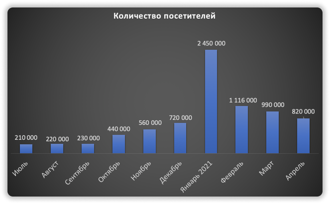
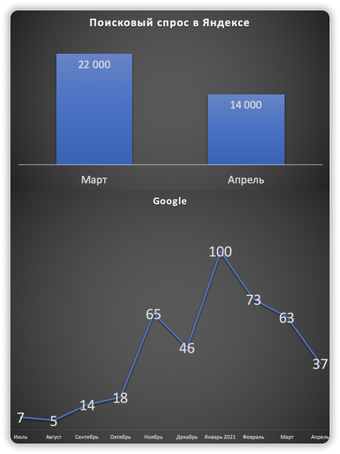
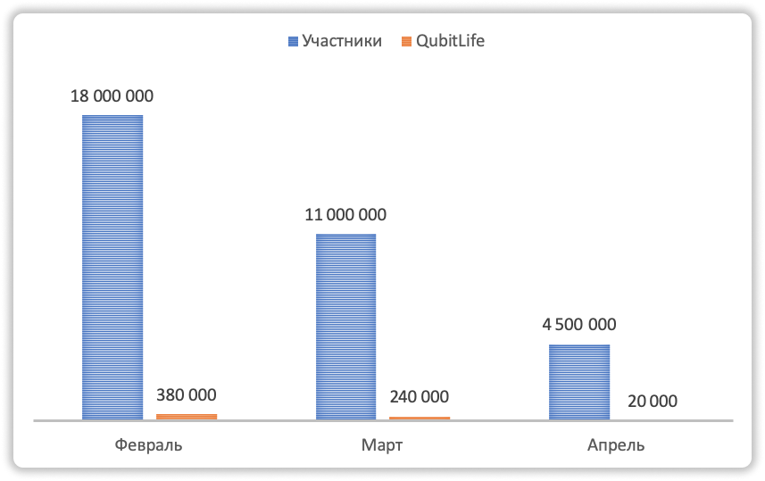
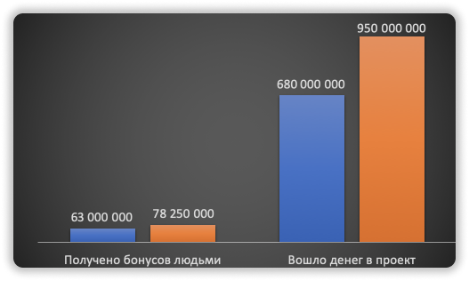

### ❓ Если возникнут вопросы → **[Telegram](https://t.me/girlwithbun)**
### 🎥 [Видео-аналитика в конце статьи](#аналитика-кубика-за-март-апрель)
***

Ребятки, провел очередной анализ QubitLife. Я его сделал в связи с жесткими изменениями в маркетинге + захотел посмотреть чё по метрикам. Читайте, наслаждайтесь! [А в конце статьи моё видео](#аналитика-кубика-за-март-апрель), всё тоже самое - только в движении :)

## Посетители Qubit Life за март-апрель 2021
***

Начиная с января 2021 года трафик на сайт qubitlife снижается. Как с поисковиков, так и прямые заходы на сайте. Это печально! 😢

## Популярность проекта в поисковых системах Яндекс и Google
***

Как и трафик, так и популярность в поисковиках снизилась сильно. Видим что в Яндексе в 2 раза, а в Google на 70%. Штош! Кубитлайф потихоньку угасает, хайп падает. Жыве QubitLife ))))00

## Сколько тратят на рекламу QubitLife-фофцы 🤑
***

Как и все показатели выше, количество денег на пиар проекта снижается. Если сравнить апрель-март, то в марте потрачено самим Кубиком 20 000$, а пользователями 4 500 000$. Это меньше примерно в 7 раз, чем за март. 

Кубик крутится - лавеха не так уже быстро мутится 🤣

## Сколько денег заработал Qubit Life к апрелю 2021
***

К апрелю 2021 года Qubit Life уже достиг капитализации в 1 млрд долларов. Это огонь! Не помню на своём веку таких жирных проектов. НО! Анализируя всё в целом видно, что прирост денег уже сокращается. Ранее был прирост в 2 раза, сейчас где-то на 30% в месяц. Еще заметил, в основном идут реинвесты, а не новые пользователи приносят свою котлету.

## Моё мнение и итоги по QubitTech (Qubit Life)
***

Я не хочу подставлять партнеров и более не зову людей в QubitLife. Риск высок. Деньги однозначно можно заработать, но рисковать репутацией - такое себе. Вытаскиваем пассив и двигаемся дальше.

А дальше это - пока что [SMG](https://pyromid.ru/smg/) и новый проект в мае, о котором скажу чуть позже.

***
💡 Вообще подписывайтесь на мои соц. сети, там я оперативнее даю информацию: [Telegram](https://t.me/pyromidinvest), [Instagram](instagram.com/pyromidi/), [YouTube](https://www.youtube.com/channel/UCc7s-9Ki7Is7YbCPpWzPcFw).
***

## Видео 
***
<iframe width="560" height="315" src="https://www.youtube.com/embed/9k5MFg0swyY" title="YouTube video player" frameborder="0" allow="accelerometer; autoplay; clipboard-write; encrypted-media; gyroscope; picture-in-picture" allowfullscreen></iframe>

***
### Полезные инструкции
[Обзор проекта SMG](https://pyromid.ru/obzor-proekta-smg-ltd/)

[Регистрация и открытие депозита в SMG](https://pyromid.ru/registraciya-popolnenie-smg/)

[Аналитика за февраль по QubitTech](https://pyromid.ru/analytika-qubittech-fevral/)

***
