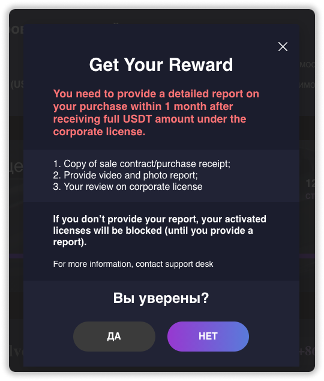
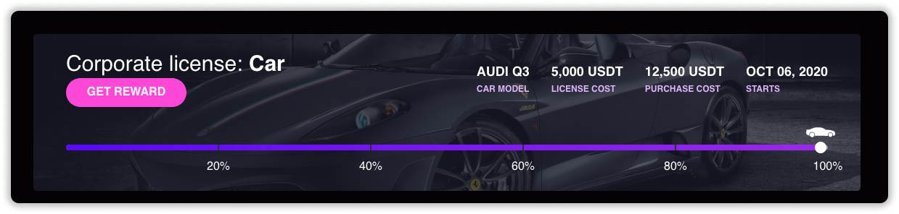
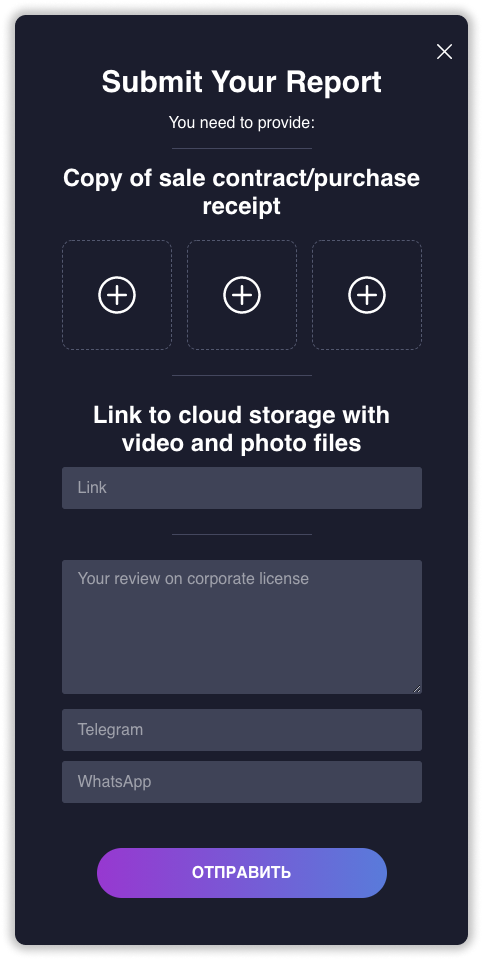

### ❓ Если возникнут вопросы → **[Telegram](https://t.me/girlwithbun)**
### 🎥 Видео инструкция находится в конце статьи.
***

Ребята. прошло уже 4 месяца с покупки **корпоративной лицензии на автомобиль** [Qubit Car]. Пришло время выводить бабосики! Ниже инструкция как вывести с корпоративной лицензии на авто. Вывод за недвижимость - аналогичный.

## Шаг 0: Проверям соблюдены ли условия
***

Для выплаты по корпоративной лицензии за автомобиль или недвижимость должны быть соблюдены 2 важных условия:

- Доходность по корпоративной лицензии не должна превышать 125%
- Наличие страхового покрытия на сумму покупки корпоративной лицензии

Если условия не соблюдены, появится сообщение, которое прикрепил ниже. Оно говорит, что нужно содать страховое покрытие. Сумма будет индивидуальная у каждого. Страховое покрытие можно создать за счет выплаты по корпоративной, нажимаете **Create insurance coverage** и выбираете способ оплаты.

**Страховое покрытие** - сумма всех лицензий равная сумме покупки корпоративной лицензии и доходность которых не превышает 125%.

### Пример №1

Вы купили корпоративную лицензию на авто за 5 000$ и получите через 4 месяца 12 500$. В момент получения выплаты по корпоративной лицензии, у вас должны быть активны цифровые лицензии в сумме на 5 000$ и доходность каждой не должна превышать 125%.

### Пример №2

Вы купили корпоративную лицензию на авто за 5 000$ и получите через 4 месяца 12 500$. В момент выплаты у вас все лицензии отработали более 125%. Вам необходимо будет докупить цифровую лицензию на 5 000$. Только после этого будет доступен вывод за авто.

### Пример №3

Вы купили корпоративную лицензию на авто за 5 000$ и получите через 4 месяца 12 500$. В момент выплаты у вас имеется только одна цифровая лицензия на 1 000$, доходность которой менее 125%. Вам необходимо докупить цифровые лицензии на 4 000$. Только после этого будет доступен вывод за авто.

## Шаг 1: Дожидаемся даты окончания лицензии + 1 день
***

Ждём ту дату по календарю, когда должна быть выплата. И прибавляем еще 1 день, так как система обновляется раз в сутки. Если вы покупали 6 октября 2020, то дата окончания будет 7 февраля 2021 года. Даже если у вас написано, что корпоративная лицензия отработала на 100%, это не значит что вывод еще работает. QubitTech [Qubit Life] округляет проценты в большую сторону, вместо 100% на самом деле может быть 99,6%.

## Шаг 2: Нажимаем на кнопку Ger Reward
***

Как только дождемся нужной даты, на корпоративной лицензии QubitTech за автопрограмму или недвижимость появится кнопка **Get reward**. Нажимаем на неё.

## Шаг 3: Соглашаемся с условиями
***

Необходимо согласиться с условиями получения вознаграждения и нажать кнопку **YES**.

### Условия очень простые

Вы доджны подтвердить покупку автомобиля в течении 1 месяца с даты получения вознаграждения по корпоративной лицензии и предоставить отчёт о покупке. В отчёт должен входить договор купли-продажи, видео и фото отчёт, написать отзыв о корпоративной лицензии. Как это делается я написал в [шаге 5](#шаг 5 корп авто).

## Шаг 4: Деньги у вас на балансе Qubit Life [QubitTech]
***

Как только вы нажмете кнопку **YES**, деньги тут же окажутся у вас в личном кабинете QubitTech. Их вы выводите согласно правилу вывода - сумма вывода в неделю не может привышеть суммарную стоимость всех купленных цифровых лицензий.

### Пример

- У вас куплено 2 цифровые лицензии: Silver и Silver+. Это 6 000$ в сумме.
- На балансе у вас 12 500$.
- Вы в неделю можете выводить только 6 000$. Получается для вывода 12 500$, вам понадобится 3 недели.

## Шаг 5: Подтверждаем покупку 
***

Покупку необходимо подтвердить в течении 1 месяца с момента получения выплаты по корпоративной лицензии.

**5.1** Нажимаем кнопку **Submit report**

**5.2** Загружаем в форму договор купли-продажи, вставляете ссылку на видео отчёт

**5.3** Пишите свой отзыв и вставляете свой ник от Telegram и WhatsApp

**5.4** Нажимаете на кнопку **Send** и всё. 

Дальше можете делать с автомобилем всё что угодно: продать, подарить, всё что в голову взбредёт. 

## Видео инструкция
***
<iframe width="560" height="315" src="https://www.youtube.com/embed/fJmUTmhtRMM" frameborder="0" allow="accelerometer; autoplay; clipboard-write; encrypted-media; gyroscope; picture-in-picture" allowfullscreen></iframe>

***
### Полезные инструкции
[Как вывести деньги с QubitTech?](https://pyromid.ru/vivod-s-qubittech/)

[Как инвестировать в QubitTech?](https://pyromid.ru/registraciya-popolnenie-qubittech/)

***
