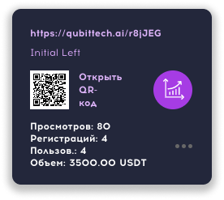

### ❓ Если возникнут вопросы → **[Telegram](https://t.me/girlwithbun)**
***

## Сколько нужно времени чтобы выйти в безубыток в Qubit Life [QubitTech]?
***
Если вы просто покупаете любую лицензию в QubitTech, то срок окупаемости 4 месяца. Каждый месяц вы получаете по 25% от депозита.

## Есть ограничения по этой схеме?
***
Данная схема работает, если у вас есть минимум 500$. Тогда срок выхода в безубыток равен 3 месяцам. Если у вас меньше 500$, то в безубыток вы сможете выйти примерно за 3,5 месяца.

## Сама схема
***
Схема работает одинаково как для 500$, так и для 5000$. Если у вас есть сомнения, напишите мне в [Telegram](https://t.me/girlwithbun), я помогу составить схему под ваш бюджет. Ниже пример для 500$.

### Шаг 1: Регистрируем аккаунт №1
***
Регистрируете первый аккаунт и активируете лицензию на 100%. [Инструкция по регистрации тут](https://pyromid.ru/registraciya-popolnenie-qubittech/).

### Шаг 2: Регистрируете аккаунт №2 и №3
***
Берете ссылку **левой ноги** из аккаунта №1 и регистрируете под неё два аккаунта №2 и №3. Активируете лицензии по 100$ на аккаунте №2 и №3

ЗАМЕТКА: Чтобы взять ссылку на левую ногу войдите в свой аккаунт №1. В меню нажмите на пункт **Партнерские ссылки** и копируете ссылку под названием **initial left**.

### Шаг 3: Регистрируете аккаунт №4 и №5
***
Берете ссылку **правой ноги** из аккаунта №1 и регистрируете под неё два аккаунта №4 и №5. Активируете лицензии по 100$ на аккаунте №2 и №3. Ссылка на правую ногу находится там же, что и левая. Называется **initial right**

## Что я получу в итоге?
***
При выполнении всех трёх шагов, вы получите:

- На свой аккаунт №1 дополнительную лицензию [быстрый старт](https://pyromid.ru/bistriy-start-qubittech/) в 100$
- Бинарный бонус на аккаунт №1 в виде 8%, это 16$
- Прямой бонус на аккаунт №1 в виде 6%, это 24$

## Итого
***
- Вложено 500$
- Вернулось в виде бонусов 40$
- Прибыль в месяц со всех лицензий 150$:

**(500$ - 40$) / 150$ = 3 месяца выход в 0.**

***
### Полезные инструкции
[Как зарегистрироваться в QubitTech?](https://pyromid.ru/registraciya-popolnenie-qubittech/)

[Что такое быстрый старт в QubitTech](https://pyromid.ru/bistriy-start-qubittech/)
***
