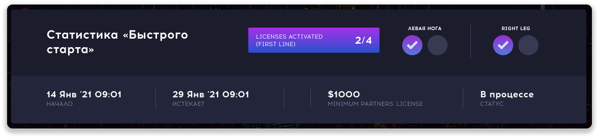
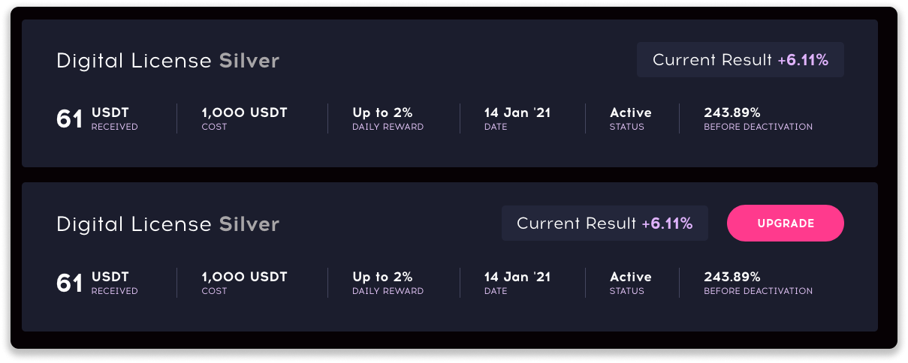

### ❓ Если возникнут вопросы → **[Telegram](https://t.me/girlwithbun)**
### 🎥 Видео инструкция находится в конце статьи.
***

## Что такое бонус быстрый старт?
***
**Бонус быстрый старт** - начисление дополнительной бесплатной лицензии на ваш аккаунт, при выполнении определенных условий.
С помощью этого бонуса вы сможете выйти в безубыток за 3 месяца вместо 4. Читайте дальше как.

## Как получить бонус быстрый старт в QubitTech?
***
1. Должны быть зарегистрированы в проекте, ссылка - [https://qubit.life/rb4zoX](https://qubit.life/rb4zoX)
2. У вас должна быть куплена любая лицензия на своём аккаунте.
3. С момента покупки лицензии не должно пройти больше 15 дней, иначе бонус не будет начислен.
4. Пригласить 2 партнера в левую ногу и 2 партнера в правую ногу. Партнеры должны оплатить лицензии на своих аккаунтах.

5. Бонусная лицензия зачисляется в течении 30 минут, иногда мгновенно. Если она не появилась - напишите в поддержку.

## А на какую сумму мне начислят бонусную лицензию?
***
Действует правило, вам начислят бонусную лицензию партнера, у которого наименьшая стоимость лицензии.

**Пример:**
Вы пригласили 4 партнера, 3 из них купили на 1000$, 1 купил на 100$. Вам начислят бонусную лицензию 100$.
Если все партнеры купили по 1000$, вам начислят 1000$.

## Как понять что её начислили?
***
В личном кабинете возле обычной своей лицензии вы увидите дополнительную. Бонус быстрый старт никак не выделяется.

## Можно ли получить 2 бонусных лицензии за быстрый старт в QubitTech?
***
Можно получить неограниченное количество бонусных лицензий быстрый старт. Нужно лишь учесть следующие условия:
1. Нужно пригласить 4 новых партнера, 2 в лево и 2 в право.
2. Успеть в период 15 дней с момента покупки вами первой лицензии.

## Другие нюансы
***
Бонусная лицензия быстрый старт от QubitTech работает ровно 4 месяца с даты начисления. Если в последний месяц вы не пригласите 1 партнера в первую линию, то она изчезнет. Если пригласите, то она продлится на пятый месяц. 
То есть, каждый последний месяц необходимо приглашать партнера, иначе её аннулируют.

**Пример:**
1. Вы получили быстрый старт 1 февраля
2. Он проработает до конца мая 
3. С 1 по 31 мая вам нужно пригласить партнера в первую линию
4. Как пригласите, быстрый старт продлевается до конца июня
5. С 1 по 30 июня вам снова нужно пригласить парнера в первую линию, хотябы на 100$
6. И так далее, пока бонусная лицензия не отработает на 250%

Официальная информация по бонусу быстрый старт QubitTech на [этой странице](https://www.qubittech.ai/faq/#faq_g5_a3).

## Видео инструкция
***
<iframe width="560" height="315" src="https://www.youtube.com/embed/r0o5-Ff4Z0w" frameborder="0" allow="accelerometer; autoplay; clipboard-write; encrypted-media; gyroscope; picture-in-picture" allowfullscreen></iframe>

***
### Полезные инструкции
[Как зарегистрироваться и пополнить счёт в QubitTech](https://pyromid.ru/registraciya-popolnenie-qubittech/)
***
