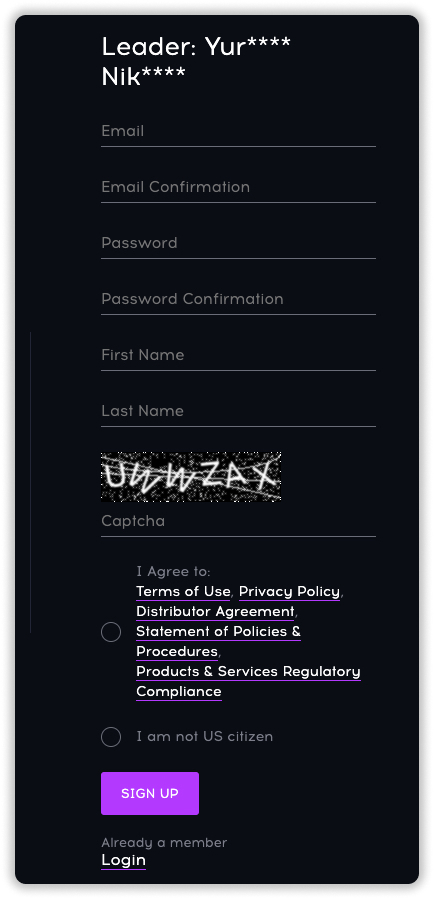
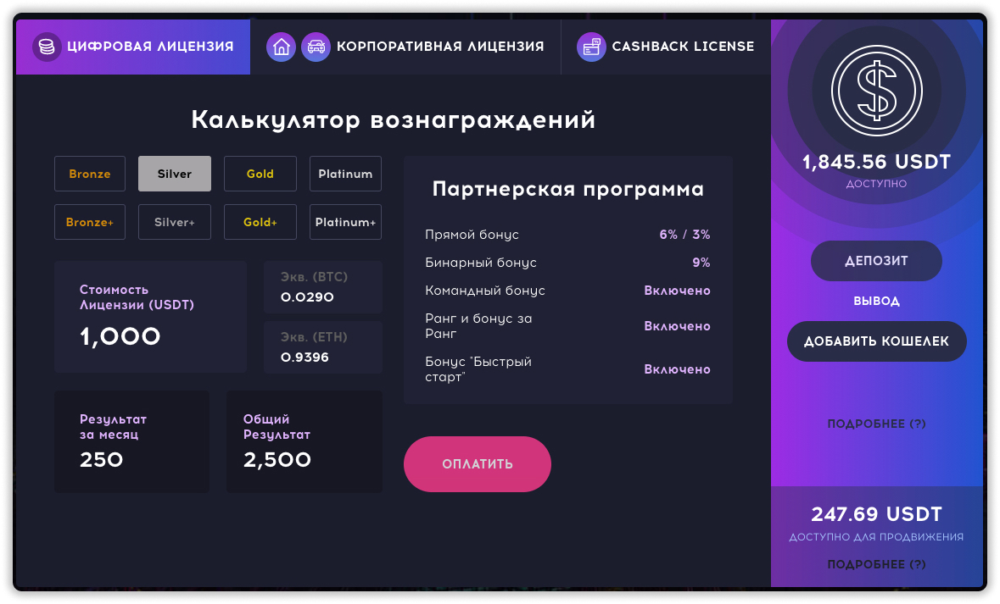
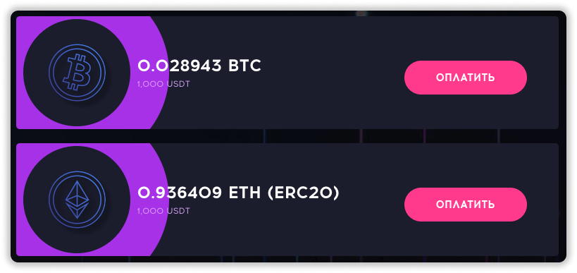
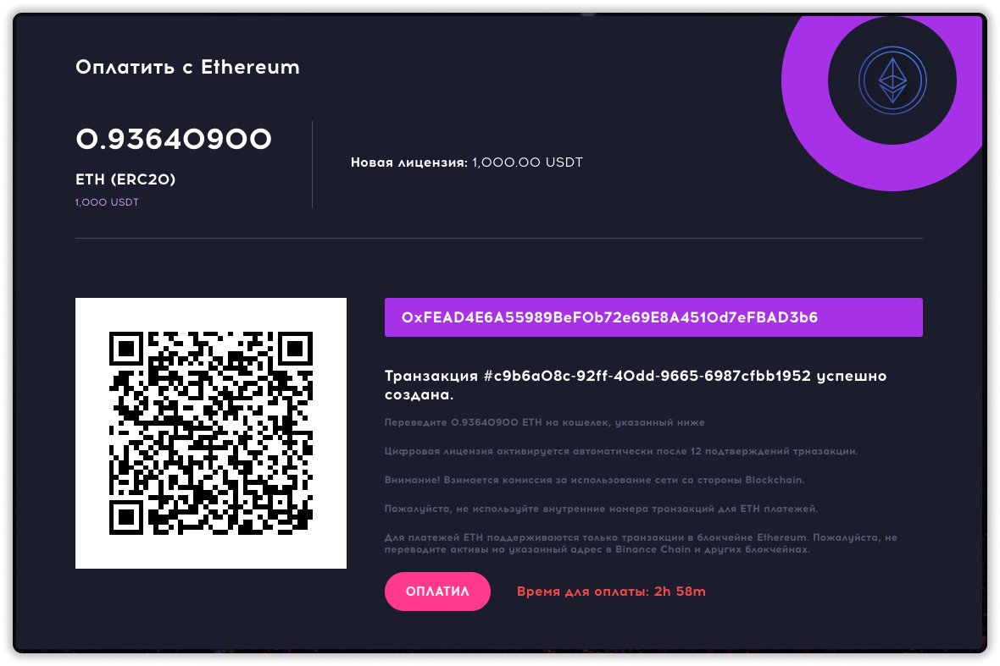
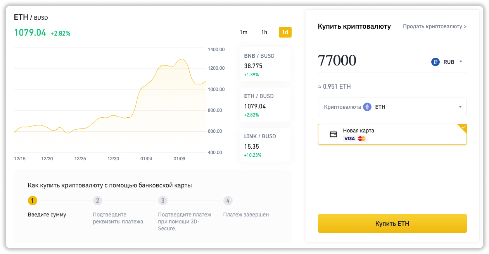
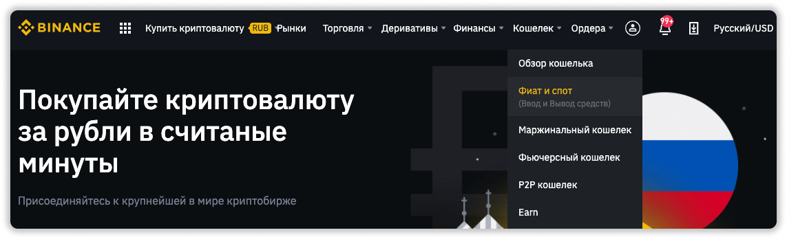
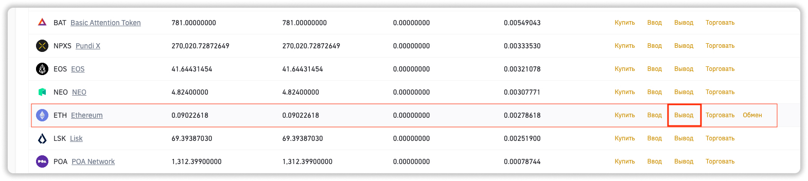
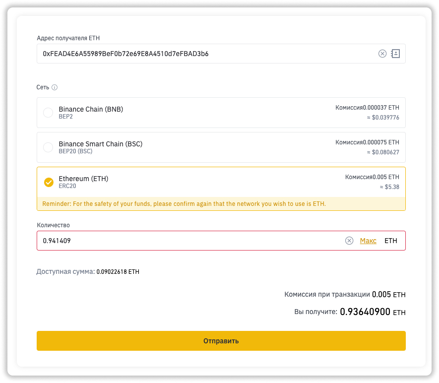

### ❓ Если возникнут вопросы → **[Telegram](https://t.me/girlwithbun)**
### 🎥 Видео инструкция находится в конце статьи.
***

`Для регистрации в Qubit Life [QubitTech] и пополнении инвестиционного счёта вам понадобится:`

- Банковская карта и криптовалюта (Bitcoin или Ethereum)
- Электронная почта
- Регистрация на бирже binance.com

## Шаг 1: Регистрируемся в самом проекте QubitTech [Qubit Life]
***

**1.1** Переходим по ссылке для регистрации - [https://qubit.life/rb4zoX](https://qubit.life/rb4zoX) и нажимаем кнопку **Регистрация**

**1.2** Заполняем все поля, вводим "капчу", соглашаемся с условиями и нажимаем кнопку **SIGN UP**

**1.3** На вашу электронную почту придет письмо, где нужно нажать кнопку **ACTIVATE**. Она активирует ваш профиль. 
Теперь можете зайти в свой профиль нажав **Войти**. Если удалось войти - значит активация пройдена.

## Шаг 2: Регистрируемся на binance.com чтобы пополнить счёт QubitTech
***

Для покупки криптовалюты и пополнения счёта QubitTech подойдет любой кошелек, но я рекомендую binance.com. Он надежный и позволяет купить криптовалюту прямо с банковской карты, в отличие от других методов.

**2.1** Переходим по ссылке [binance.com](https://accounts.binance.com/ru/register) и регистрируемся

**2.2** Проходите верификацию. Она занимает 1-2 дня.

Кликай, если нужна [Подробная инструкция по прохождению верификации на binance](/verifikaciya-binance/).

## Шаг 3: Пополняем Qubit Life
***
В данной инструкции пополняем через биржу binance.com. Если у вас другой кошелек, скорее всего вы знаете как им пользоваться.

**3.1** Заходите в ваш личный кабинет QubitTech

**3.2** В **Калькуляторе вознаграждений** выбираем нужную лицензию:

- Bronze - 100$
- Bronze+ - 500$
- Silver - 1 000$
- Silver+ - 5 000$
- Gold - 10 000$
- Gold+ - 25 000$
- Platinum - 50 000$
- Platinum+ - 100 000$

В своём примере, я буду инвестировать 1 000$ - это пакет Silver. Нажимаем **Оплатить**.

**3.3** Выбираем в какой криптовалюте будем пополнять баланс. Я рекомендую в ETH (Ethereum). Мы его купим позже на binance. Напротив нажимаем **Оплатить**.

**3.4** Появится окно оплаты. Слева сверху сумма, которую нужно перечислить, снизу фиолетовым выделен кошелек, куда нужно перевести ETH (Ethereum).

Пункты 3.5-3.8 можно пропустить, если у вас есть криптовалюта на бирже binance.

**3.5** Заходим на [binance.com](http://binance.com) и слева сверху нажимаем **Купить криптовалюту → Кредитная / Дебетовая карта**

**3.6** Выбираем вашу национальную валюту, у меня это RUB. Ниже выбираем ETH (Ethereum). Вводим то количество рублей, чтобы оно соответствовало нужному количеству криптовалюте ETH (Ethereum). Нужное количество отображается в вашем личном кабинете QubitTech, об этом писали в **пункте 3.4**. 

**Важно: купите с запасом на 1000 рублей больше, так как будут комиссии при переводе.**

**3.7** Нажимаем на кнопку **Купить** и вводим данные банковской карты в форме.

**3.8** Подтверждаете покупку с помощью SMS и кода, который пришел на почту.

**Важно: подождать 20-30 секунд, пока пройдет транзакция.** 

**3.9** Переходите в раздел **Кошелек → Фиат и спор**

**3.10** Напротив ETH (Ethereum) нажимаете **Вывод**

**3.11** Вставляете кошелек с QubitLife. Выбираете сеть ERC20. Вводите количество ETH (Ethereum), которое показывается в QubitTech плюс комиссию, которая указывается ниже. И нажимаем **Отправить**. Вывод подтверждается SMS и кодом на вашу почту.

**3.12** Переходим в кабинет Qubit Life и нажимаем **Оплатил**

`Через 30-60 минут деньги зачислятся на счёт. Первые выплаты придут через 2 суток.`

## Видео инструкция
***
<iframe width="560" height="315" src="https://www.youtube.com/embed/gh9E9rwUfeo" frameborder="0" allow="accelerometer; autoplay; clipboard-write; encrypted-media; gyroscope; picture-in-picture" allowfullscreen></iframe>

***
### Полезные инструкции
[Как получить бесплатную лицензию в QubitTech?](https://pyromid.ru/bistriy-start-qubittech/)
***
