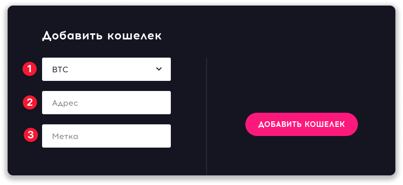
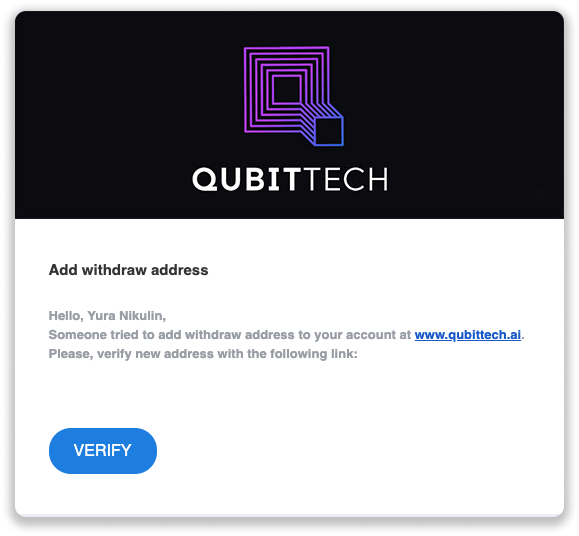
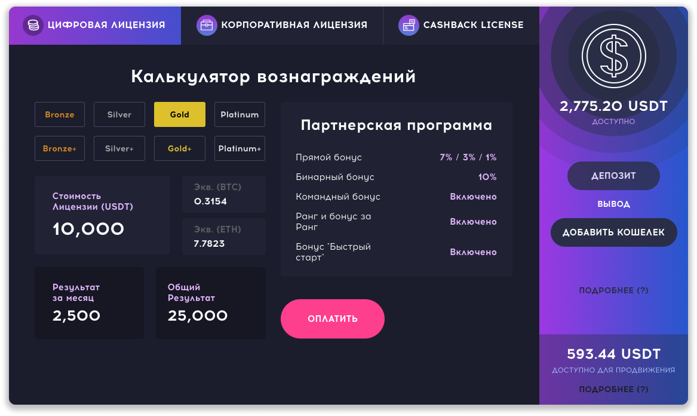
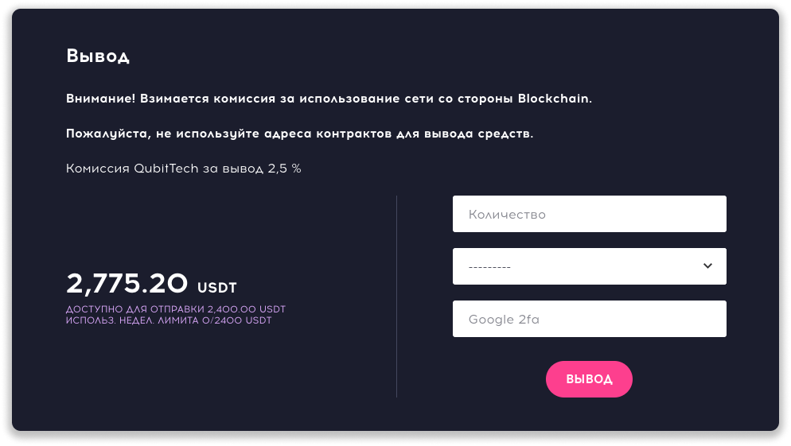

### ❓ Если возникнут вопросы → **[Telegram](https://t.me/girlwithbun)**
### 🥳 [Telegram](https://t.me/pyromidinvest) | [Instagram](http://instagram.com/pyromidi) | [YouTube](https://www.youtube.com/channel/UCc7s-9Ki7Is7YbCPpWzPcFw)
***

**ВАЖНО:** Хоть начисления в проекте идут в долларе, но вывод из QubitTech / QubitLife осуществляется в Bitcoin или в Ethereum. Поэтому вам нужен криптовалютный кошелек.

## Шаг 1: Привязываем ваш криптовалютный кошелек
***
Если кошелек привязан - переходите к **шагу 2**.
После привязки кошелька, вам нужно подождать 72 часа. Это защита и система не позволит вывести средства на новый привязанный кошелек мгновенно.

1.1 Авторизируетесь в QubitTech / QubitLife и нажимаете кнопку **Добавить кошелек** в правой части экрана

1.2 В первом поле, выбираете в какой криптовалюте вам перечислить средства. Обычно в Ethereum (ETH) деньги приходят быстрее.

1.3 Во втором поле вставляете ваш криптовалютный кошелек.

1.4 В поле **Метка** вводите любую фразу. Она нужна для вас, чтобы вы понимали, куда выводите средства. Например: "вывод btc на binance"

1.5 Нажимаете **Добавить**

1.6 На почту придет письмо с подтверждением привязки, нажмите кнопку **Verify**

## Шаг 2: Выводим средства с QubitTech
***
2.1 Заходим в свой аккаунт и нажимает **Вывод**

2.2 Вводим доступную вам сумму в первое поле

2.3 Выбираем криптовалютный кошелек, который вы привязали в шаге 1

2.4 Если у вас привязана 2fa - вводим её, если нет, пропускаем этот пункт

2.5 Нажимаем **Вывод** и ожидаем поступление средств в течении 72 часов

Как только QubitTech отправит деньги, на вашу почту придет оповещение о переводе. Нужно подождать 1-2 часа, прока в сети криптовалюты пройдет транзакция.

## Есть ли проценты за вывод из QubitLife?
***
Проект удерживает комиссию 2,5% от суммы вывода.

**Пример:**
Выводите 10$, на ваш счёт поступить ~9,75$.

## Какие лимиты и ограничения на вывод?
***
Минимальный вывод с проекта 10$. В течении 24 часов можно подать только 1 заявку на вывод средств.

Официальную информацию по выводу QubitTech можно посмотреть по [этой ссылке](https://www.qubittech.ai/faq/#faq_g6_a5).

## Видео инструкция
***
<iframe width="560" height="315" src="https://www.youtube.com/embed/oIfrRX_QSkY" frameborder="0" allow="accelerometer; autoplay; clipboard-write; encrypted-media; gyroscope; picture-in-picture" allowfullscreen></iframe>
