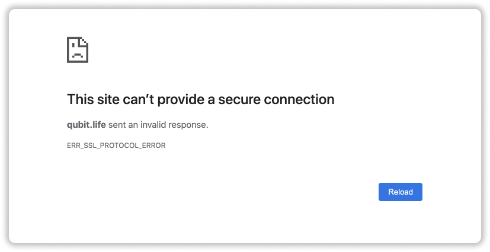
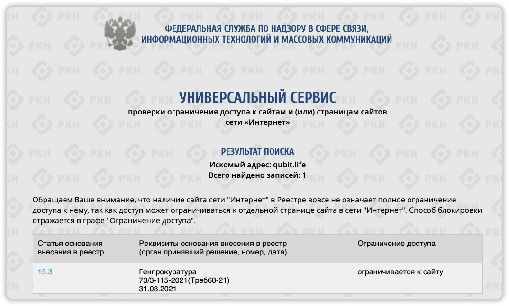

## Краткая новость о блокировки Qubit.Life в России
***
📍 **Обновлено 17.04.2021** - сайт qubit.life разблокирован. А так же, создано зеркало сайт qbt.life.

31 марта - знаменательная дата 🤣. Роскомнадзор заблокировал сайт Qubit.Life в России по решению Генпрокуратуры. Статья блокировки 13.3. Все подробности ниже.

## Это фейк или реально заблокировали?
***
Ребята, я публикую только проверенную информацию. Для проверки самостоятельно зайдите на сайт [https://blocklist.rkn.gov.ru/](https://blocklist.rkn.gov.ru/) и введите сайт. Вам высветится причина блокировки.

## За что заблокировали Qubit.Life?
***
Сайт qubit.life заблокирован по статье [15.3](https://blocklist.rkn.gov.ru/article15-3/) РФ. Статья выглядит очень странно, простыми словами, сайт заблокирован за экстремистские цели или массовые сборы, которые ведут к вреду здоровья людей. Кажется что кто-то пожаловался на Base Camp.

Ведь именно в этот период начали блокировать рекламные активности. Не исключаю, что это "стук" от конкурентов.

## Как зайти на сайт Qubit.Life?
***
Для России теперь понадобится VPN сервис. Есть много бесплатных, но я пользуюсь платной версией TunnelBear. Она есть как на телефоны, так и на компьютеры. Главное подключите другую страну, не нужно пробовать заходить с VPN России, это бессмысленно. 

## Чем это грозит проекту?
***
В принципе ничего серьезного. Роскомнадзор блокирует многие сайты даже ошибочно. Но, чтобы разблокировать Qubit.Life должен подать жалобу. Приток средств из России конечно сократиться и у людей уже трудности, они не понимают что такое VPN и как этим пользоваться. 

**Моё мнение:**

Проект может жить спокойно еще 5-6 месяцев, а там уже посмотрим. Риск стал намного выше, так что подумайте заранее. От себя добавлю, что всех своих ребят перевожу в  новый проект [SMG](https://smg.ltd/r/valyapar). Открылся 4 марта 2021 года, свеж и полон сил. Если что, пишите в [Telegram](https://t.me/girlwithbun).

## Стоит ли заходить в Qubit.Life сейчас?
***
Решать вам. Риски я вам дал, но советовал бы заходить в более свежие и низкорискованные проекты. Как писал выше, советую проект SMG. Полная информацию о нем на **[этой странице](https://pyromid.ru/smg/)**.

***
### Полезные инструкции
[Smart Medical Generation регистрация и пополнение](https://pyromid.ru/registraciya-popolnenie-smg/)

[Обзор проекта Smart Medical Generation](https://pyromid.ru/obzor-proekta-smg-ltd/)
