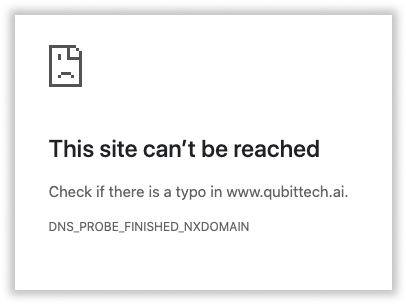

## Важная информация о QubitTech
***
В данный момент на оригинальный сайт QubitTech.ai производится DDOS-атака. Это означает, что сайт часто не работает. Угрозы кражи данных нет. QubitTech просить сейчас не заходить на сайт, так как это еще сильнее затрудняет работу.

## На какой сайт теперь заходить?
***
Платформа создала безопасное зеркало сайта [qubittech.dev](https://qubittech.dev/). Пользуйтесь временно этим доменом.

## Комментарий от меня
***
Я проверил новый домен [qubittech.dev](https://qubittech.dev/) на наличие уязвимостей и вирусов. Всё ок! QubitTech никто не взамывал и перенос сайта на другое зеркало - их решение. Не забудьте также поменять реферальные ссылки и кидать новые, иначе партнеры не смонут зарегистрироваться.

***
### Полезные инструкции
[Как зарегистрироваться в QubitTech?](https://pyromid.ru/registraciya-popolnenie-qubittech/)

[Что такое быстрый старт в QubitTech](https://pyromid.ru/bistriy-start-qubittech/)

[Инструкция по выводу денег с QubitTech](https://pyromid.ru/vivod-s-qubittech/)
***
