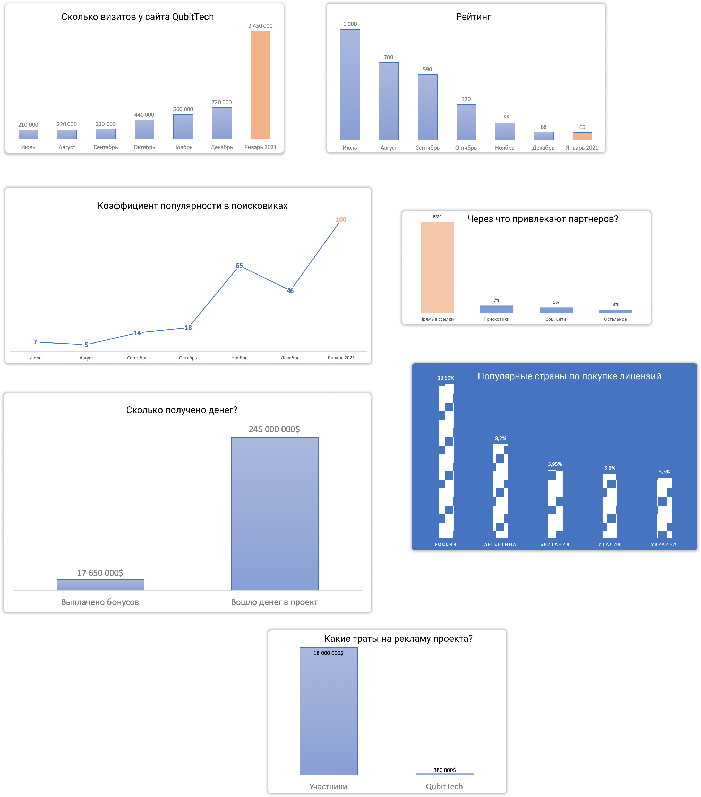

### ❓ Если возникнут вопросы → **[Telegram](https://t.me/girlwithbun)**
### 🥳 [Telegram](https://t.me/pyromidinvest) | [Instagram](http://instagram.com/pyromidi) | [YouTube](https://www.youtube.com/channel/UCc7s-9Ki7Is7YbCPpWzPcFw)
***

Привет! Ну что, дождались моего отзыва о QubitTech? Сейчас буду показывать сколько я в проекте, сколько вывел денег и как работают выводы у моих партнеров. А сейчас давайте по порядку!

## Когда я зашел в QubitTech?
***

Дело было в июне 2020 года, когда проект только-только стартовал. Вложил я на старте $1 000, чисто протестировать проект. Заходил пассивно, чтобы вы не думали, без партнёров!

## Почему я понял, что QubitLife - ТОП!?
***

Дело в том, что за 3-4 месяца я собрал огромную статистику по проекту. Сколько денег туда завели люди, сколько там пользователей, рекламируется ли Кубитек. Увидел коллосальные цифры! Мою последнюю аналитику вы можете [посмотреть тут](https://pyromid.ru/analytika-qubittech-yanvar/).

## Немного статистики за Январь 2021
***

1. За Январь в QubitTech вошло $245 000 000 !!! Это вертикальный рост капитализации проекта. Думаете до сих пор что QubitTech - это развод? 😂
2. Количество  пользвователей выросло в 3,5 раза. Это говорит о том, что Кубик становится международной компанией
3. На рекламу QubitTech потратила $380 000, а сами пользователи прорекламировали его на $18 000 000. 

Вот вам краткий скрин-шот с метриками роста проекта, каждый сможет сделать выводы сам.

Если хотите посмотреть полный отчёт о проекте, то вот [ссылка](https://pyromid.ru/analytika-qubittech-yanvar/) на него.

## Сколько я вложил и заработал
***

На 17 февраля 2021 года я лично вложил $100 000 в цифровые лицензии и $5 000 в корпоративную лицензию на автомобиль. О ней я подробно рассказывал в статье **[Инструкция как вывести деньги с корпоративной лицензии авто](https://pyromid.ru/vivod-korporativnaya-licenziya-avto-qubittech/)**.

Я полностью вышел в плюс по цифровым лицензиям и получаю пассивный доход. Со мной работает уже 1 000 партнеров, я учу их привлекать людей с помощью рекламы и маркетинга - это моя фишка.

Заработал в проекте с учетом пассивного дохода и привлеченных партнеров $400 000. Хотите также, пишите мне **Хочу в команду** в [Instagram](https://www.instagram.com/pyromidi/) или [Telegram](https://t.me/girlwithbun).

## Итоговый отзыв и прогнозы QubitTech / QubitLife
***

1. На данный момент проект платит по полной программе и у него есть деньги, исходя из статистики, которую я делаю каждый месяц. Если что-то пойдет не так, дам информацию в своём [Telegram канале](https://t.me/pyromidinvest).
2. По моим прогнозам, QubitTech проживет до конца 2021 года. Есть чётка корреляция с курсом роста криптовалюты. В начале пути мы им заводили дешевые биткоины, с которых они сейчас нам выплачивают $. Грубо говоря, они в плюсе на 300-400%.
3. Кубик еще не запустил все свои продукты - это дает жизнь и новые деньги в проект. С запуском всех видов лицензий будет немного опасно входить.
4. Если хотите поучаствовать в проекте, то вот [инструкция по регистрации](https://pyromid.ru/registraciya-popolnenie-qubittech/)

Ну что, а каковы ваш отзыв и мысли по поводу QubitTech? Go пообсуждаем в [Telegram](https://t.me/pyromidinvest)?

***
### Полезные инструкции

[Аналитики по проекту QubitTech за Январь 2021](https://pyromid.ru/analytika-qubittech-yanvar/)

[Как вывести деньги с QubitTech?](https://pyromid.ru/vivod-s-qubittech/)

[Как инвестировать в QubitTech?](https://pyromid.ru/registraciya-popolnenie-qubittech/)

***
