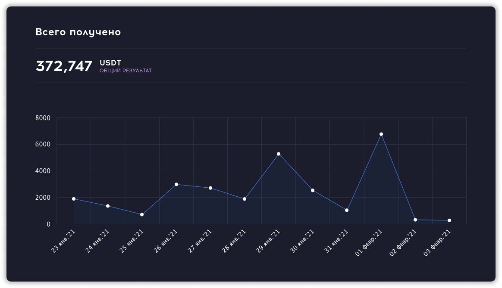

## Заработал за 7 месяцев 370 000$ в QubitTech
***
Да, да - это скам, развод, обман и другие плохие слова 💩. Можете дальше так думать, а я пойду рубить бабосик!
Друзья, это моё личное мнение. Я до сих пор нахожусь в проекте и он платит. В моей команде около 700 человек. Как будут риска скама - я напишу.

## А как заработал то?
***
Всё просто, около 250 000$ я заработал на привлечении партнеров и 120 000$ по пассивному доходу. Приносит проект 25% в месяц.
Все свои шаги по заработку я публикую в [Telegram](https://t.me/pyromidinvest), а в [Instagram](https://www.instagram.com/pyromidi) показываю куда трачу деньги.
В моих соц. сетях последние новости только по QubitTech, так как проект платит хорошие %.

## Где пруфы, не верю! QubitTech / QubitLife - это развод!
***
Окей бро! Ты меня скорее всего не знаешь и твоё недоверие оправдано. Но что если я в режиме реального времени покажу как вывожу деньги и покажу свой кошелек?
Я не тащу тебя в проект, скорее всего ты читаешь эту статью и просто ищешь ответы. Скорее всего ты уже в проекте и думаешь делать ли депозит.
Не хочешь звонить, тогда полистай мой [instagram](https://www.instagram.com/pyromidi), [telegram](https://t.me/pyromidinvest), [youtube](https://www.youtube.com/channel/UCc7s-9Ki7Is7YbCPpWzPcFw). Ты поймешь, что я даю сигналы и полезные проекты на старте. Чем богаче мои партнеры - тем лучше мне.
Так что забудь это слово - **QubitTech развод** 😈.

## Мои выводы по QubitLife
***
QubitTech - это высокодоходный проект, где риски потерять деньги конечно же есть. Но до сих пор он платит. По моим прогнозам он проживет до конца 2021 года, это связано с ростом криптовалюты.
Лично сам вкладываю средства до сентября 2021, а там будет виднее.

Да, проект не рассчитан на долгосрочное сотрудничество, а зачем оно. Ведь вы можете получить большие % за год-два и пойти в новый проект.

***
### ❓ Если возникнут вопросы → **[Telegram](https://t.me/girlwithbun)**

***
### Полезные инструкции
[Как зарегистрироваться в QubitTech?](https://pyromid.ru/registraciya-popolnenie-qubittech/)

[Что такое быстрый старт в QubitTech](https://pyromid.ru/bistriy-start-qubittech/)

[Инструкция по выводу денег с QubitTech](https://pyromid.ru/vivod-s-qubittech/)
***
