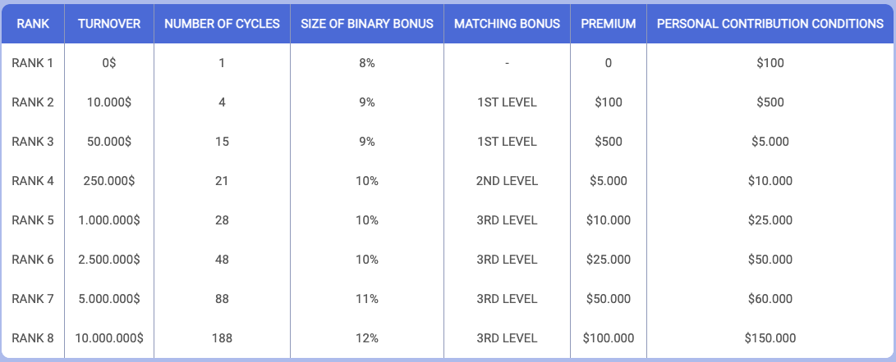
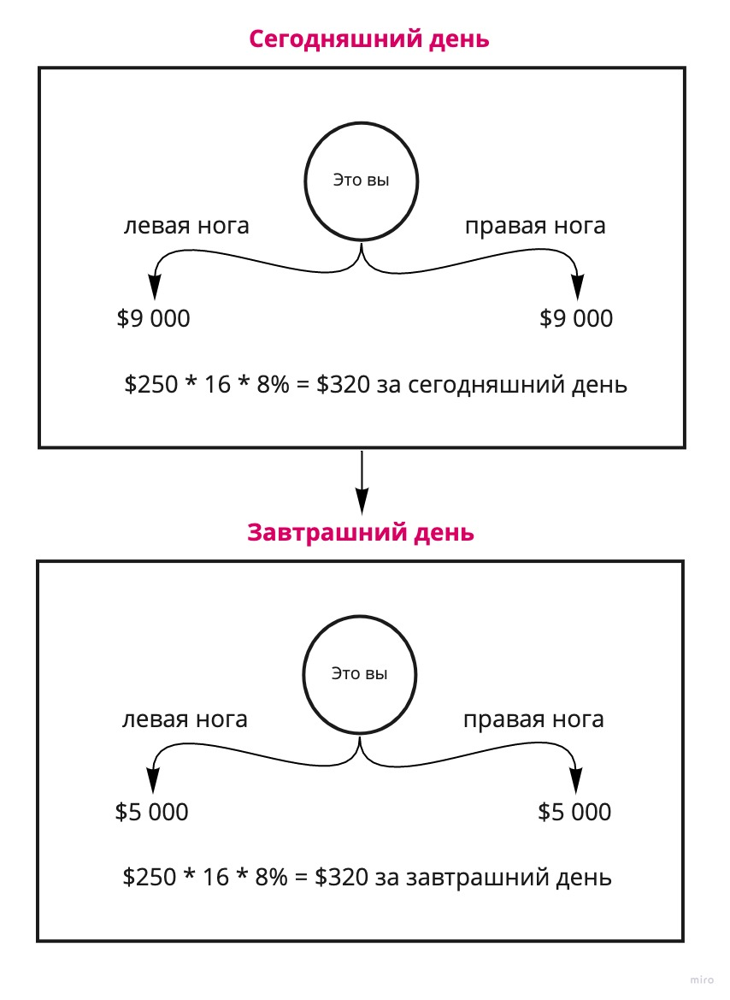
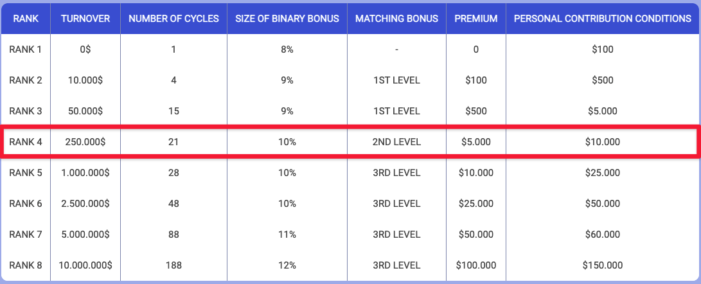

### ❓ Если возникнут вопросы → **[Telegram](https://t.me/girlwithbun)**
### 🎥 [Видео-обзор в конце статьи](#обзор-smg-видео)
***

В данной статье разберемся с новым хайп проектом Smart Medical Generation. Поговорим подробно о легенде проекта, какие инвестиционные пакеты доступны партнёрам и какие бонусы существуют за приглашение в [https://smartmedicalgeneration.ltd](https://smartmedicalgeneration.ltd/r/valyapar). Если вы ещё не регистрировались, советую это сделать, чтобы получить максимальный бинарный перелив → **[Регистрация](https://smartmedicalgeneration.ltd/r/valyapar)**.

## Основатель
***

Проект считается азиатским, без всяких примесей. Тут нет так такового админа, есть президент компании, которых во благо всего мира хочет помочь в борьбе с медицинскими проблемами. Президент **Fu Tianming**. Наверно не буду рассказывать его историю, все президенты/админы или как их там ещё называют - прикрытие. Легенда, легеной, но нужно понимать что это хайп! Команду проекта можно посмотреть по [этой ссылке](https://smartmedicalgeneration.ltd/en/about-us).

## Легенда
***

Сама компания зарегистрирована в Шотландии и у неё есть открытые контакты, кто хочет [вот тут](https://smartmedicalgeneration.ltd/en/contacts). Владеете английским или китайским - звоните, порасспрашивайте их. Лично сам звонил, спрашивал работают ли с оптовыми поставщиками и т. д. Впечатление, как будто обычная китайская фирма!

### Чем занимаются и с чего деньги?
- Компания живет за счет реализации перчаток, халатов, антисептиков и медицинских масок. В среднем с этого направления они делают 400% годовых. 
- И второе направление, это инвестиции и диверсификация вложенных средств. Что-то в IT медицину, что-то в страховые фонды и так далее.

Блин, хватит об легенде, все понимают что это хайп - Я ВАМ ГОВОРЮ! Давайте лучше о наших деньгах

## Пассивный заработок
***

### Инвестиционные пакеты

Официальная информация по бизнес модели можете посмотреть на [официальном сайте smg.ltd](https://smartmedicalgeneration.ltd/en/business-model). В компанию можно вложиться и получать пассивный заработок каждый день. Всего существует 4 инвестиционных пакета, которые дают 1% в день от вклада:
- Test [от $100 до $499]
- Start [от $500 до $999]
- Pro [от $1 000 до $4 999]
- VIP [от $5 000 до ∞]

Я уже всё сделал за вас и проанализировал каждый. Рекомендую покупать пакет Pro от $1 000, так как проценты по пакету начисляются уже через 12 дней. В пакетах меньше $1 000 вы будите выходить в ноль уже дольше. Но разберем каждый пакет подробно:

#### Test
- Минимальная сумма инвестирования **$100**
- Максимальная сумма инвестирования **$499**
- Можно приобрести только **1 раз**
- Доход 1% в день. Из которых 65% идут вам на кошелек, а 45% в реинвест кошелек. Реальный процент - 0,65% в день
- Инвестиционный пакет начинает работать через 28 дней

При таком инвестиционном пакете выход в безубыток через **154 + 28  = 182 дня**.

**Реинвест кошелек** - отдельный кошелек, куда копятся $, которые можно только на покупку инвестиционного пакета. К реинвесту можно добавлять свои средства. Если у вас на реинвесте $100, можно добавить $400 и купить пакет Start.

#### Start
- Минимальная сумма инвестирования **$500**
- Максимальная сумма инвестирования **$999**
- Можно приобрести неограниченное количество раз
- Доход 1% в день. Из которых 70% идут вам на кошелек, а 30% в реинвест кошелек. **Реальный процент - 0,7% в день.**
- Инвестиционный пакет начинает работать через **18 дней**

При таком инвестиционном пакете выход в безубыток через **143 + 18 = 161 дня**.

#### Pro
- Минимальная сумма инвестирования **$1 000**
- Максимальная сумма инвестирования **$4 999**
- Можно приобрести неограниченное количество раз
- Доход 1% в день. Из которых 80% идут вам на кошелек, а 20% в реинвест кошелек. **Реальный процент - 0,8% в день.**
- Инвестиционный пакет начинает работать через **12 дней**

При таком инвестиционном пакете выход в безубыток через **125 + 12 = 137 дня**

#### VIP
- Минимальная сумма инвестирования **$5 000**
- Максимальная сумма инвестирования не ограничена
- Можно приобрести неограниченное количество раз
- Доход 1% в день. Из которых 90% идут вам на кошелек, а 10% в реинвест кошелек. **Реальный процент - 0,9% в день.**
- Инвестиционный пакет начинает работать через **8 дней**

При таком инвестиционном пакете выход в безубыток через **111 + 8 = 119 дня**.

Как видите, покупать пакеты Test и Start крайне не выгодно. Рекомендую заходить от $1 000. Плюс воспользуйтесь [моей схемой по выходу в безубыток ещё быстрее](/bistryi-vihod-v-bezubitok-v-smg/).

### Начисление % за Holding баланса

Holding бонус даёт дополнительную мотивацию не выводить накопленные средства с балансов. Он начисляется **только** на доход по инвестиционным пакетам. Holding начинает работать, если у вас на балансе не менее $50. Бонусы начисляются ежедневно, но выводить их можно 1 раз в месяц.

#### Условия холдинга
1 месяц: 4% на сумму остатка баланса
2 месяц: 5% на сумму остатка баланса
3 месяц: 6% на сумму остатка баланса
4 месяц: 7% на сумму остатка баланса
5 месяц: 8% на сумму остатка баланса
6 месяц: 9% на сумму остатка баланса

## Партнёрская программа
***

В Smart Medical Generation существует 3 вида партнёрской программы: линейный, бинарный и командный. Далее ниже разберём каждый из них. Самый топовый тут - бинарный, скоро узнаете почему.

### Линейный

Линейный маркетинг в SMG очень простой:

- 5% от партнёров первого уровня
- 2% от партнёров второго уровня
- 1% от партнёров третьего уровня
- Остальные уровни не идут в счёт.

**Важно замечание**: с линейной программы 10% от дохода идёт в реинвест кошелек. Об это не сказано в презентации, но я это выяснил опытным путём.

### Бинарный

Бинарный маркетинг в Smart Medical Generation очень хитрый и не даёт вымывать много денег из кассы, но у него есть один крутой плюс - бинар не сгорает! Ниже объясняю. Начнём по порядку.

#### Бинарный циклы

Наверно видели в [презентации](https://t.me/pyromidinvest/105), есть какие-то бинарные циклы. Для чего они нужны давайте посмотрим. В каждом инвестиционном пакете есть количество бинарных циклов, а так же от оборота структуры начисляются дополнительные циклы. Один бинарный цикл равен $250. Циклы активируются каждый день. Пока что просто запомните это и посмотрите на свой пакет, сколько циклов у вас?

#### Проценты за бинар

Проценты по бинару считаются от вашего ранга / оборота команды. Если у вас $0 оборота, то бинар 8%, если оборот $10 000, то бинар 9% и так далее. Ниже прикрепляю картинку со всеми рангами. Пока тоже держите это в голове.

#### Считаем на конкретном примере

Вы покупаете инвестиционный пакет VIP, в котором 15 бинарных циклов. Плюс за оборот $0 - $9 999 ещё 1 цикл. Итого у вас 16 циклов. Представим, что вы пригласили в левую и правую ногу на $9 000. Считаем:

**16 циклов * $250 * 8% = $320 в день**

**Поясняю:** 15 циклов у вас есть из пакета VIP + 1 цикл даётся за 0 ранг. Итого 16 циклов. Один цикл равен $250, следовательно 16 умножаем на 250. И смотрим по таблице, за 0 ранг вам доступен бинарный процент в виде 8%. Умножаем на него.

**Пояснение 2:**Умножаете 16 циклов на 250, это же 4 000. То есть, вам пришло только с $4 000, а не с $9 000. Почему? Да потому, что у вас всего лишь 16 циклов в день. На следующий день еще раз активируются 16 циклов. Каждый день в нашем примере с лева и справа будет отниматься по $4 000, из-за того, что циклы тратят этот оборот для выплаты вам награды по бинару. Ниже картинка, в ней понятнее.

### Бонусы за ранги

При выполнении определённого оборота команды вам начисляются единоразовые выплаты, которые можно вывести мгновенно. Ниже прикрепляю табличку и выделяю какие условия нужно достигнуть. Давайте на одном примере разберемся.

Чтобы получить бонус в $5 000 вам нужно самому иметь инвестиционный пакет в $10 000. А так же, оборот по своей ноге (НЕ ПО НОГЕ СПОНСОРА) $250 000. 

## Итоги
***

Как видите маркетинг такой хитрый, что не даёт забрать кассу лидерам. Это хороший сигнал к тому, что на пассиве можно выйти в 0 и спокойно заработать. Мой личный депозит в проекте $105 000. Дальше уже посмотрю как будут идти дела. Если остались вопросы - пишите мне в [Telegram](https://t.me/girlwithbun). 

## Видео обзор Smart Medical Generation 
<iframe width="560" height="315" src="https://www.youtube.com/embed/nEUZAMsEnKU" title="YouTube video player" frameborder="0" allow="accelerometer; autoplay; clipboard-write; encrypted-media; gyroscope; picture-in-picture" allowfullscreen></iframe>
***

***
### Полезные инструкции

[Инструкция по регистрации и инвестирования в Smart Medical Generation](https://pyromid.ru/registraciya-popolnenie-smg/)

[Инструкция по выводу денег в Smart Medical Generation](https://pyromid.ru/vivod-smg/)

[Как выйти в безубыток быстрее в проекте Smart Medical Generation](https://pyromid.ru/bistryi-vihod-v-bezubitok-v-smg/)

***
