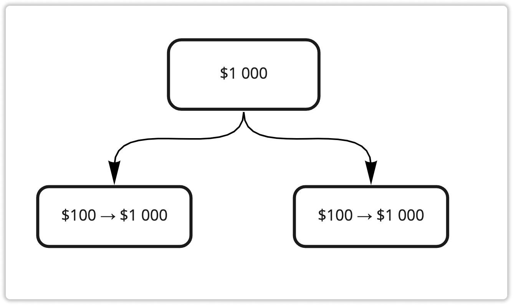
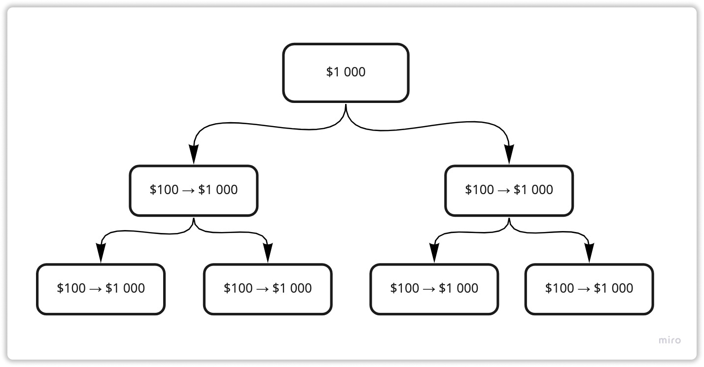

### ❓ Если возникнут вопросы → **[Telegram](https://t.me/girlwithbun)**
***

Данная схема с мульти-аккаунтами работает эффективно, если у вас имеется минимум $3 200. Если меньше, то не имеет смысла ей пользоваться. Так как на инвестиционных пакетах менее чем 1000$ время активации очень высокое. Подробнее о пакетах, активации и самой компании я рассказываю в этой статье → [Новый хайп проект Smart Medical Generation](/obzor-proekta-smg-ltd/). Если еще не регистрировались, то вот [инструкция](https://pyromid.ru/registraciya-popolnenie-smg/).

❗️**ВАЖНО:** После регистрации первого аккаунта - написать мне. Я поставлю вас в бинарной структуре и вы далее уже можете создавать нижестоящие аккаунты. 

## Схема №1: если у вас от $3 200 до $5 000
***

В этой схеме всё просто. Создаёте 3 аккаунта: Основной и под него 2 дополнительных. В основной аккаунт инвестируете $1 000. В дополнительные в начале, для активации бинара по $100. Как придет $100, докупаете пакеты по $1 000. Нужно вложить $3 200.

### Итого получите, если инвестируете $3 200

**На основной аккаунт:** 

	$1 000 * 8% = $80 бинара

	$2 200 * 5% = $110 линейный

## Схема №2: если у вас от $7 600 до ∞ 
***
Так как проект нас ограничивает активацией инвестиционных пакетов, то эта схема подходит всем, у кого от $7 000. Главное запомните, всем аккаунтам делайте пакеты по $1 000. И если появляются свободные средства, апгрейдите нижестоящие аккаунты, тогда будет максимальный профит. То есть, усиливайтесь с низу в верх. 

### Итого получите, если инвестируете $7 600

**На основной аккаунт:**

	$3 200 * 8% = $256 бинара

	($2 200 * 5%) + ($4 400 * 2%) = $198 линейный

**На мульти-аккаунты:**

	$1 000 * 8% * 2 = $160 бинара
	
	$2 200 * 5% * 2 = $220 линейный
	
Итого: $834 можно вернуть сразу, если сделать мульти-аккаунты под $7 600. 

## Итоги
***
Как вы поняли, схема с мульти-аккаунтами тут работает от больших сумм. Так что не ленитесь и посчитайте каждый для своего случая. Если прям не получается, пишите мне в [Telegram](https://t.me/girlwithbun).

***
### Полезные инструкции

[Инструкция по регистрации и инвестирования в Smart Medical Generation](https://pyromid.ru/registraciya-popolnenie-smg/)

[Инструкция по выводу денег в Smart Medical Generation](https://pyromid.ru/vivod-smg/)

[Полный обзор проекта Smart Medical Generation](https://pyromid.ru/obzor-proekta-smg-ltd/)

***
