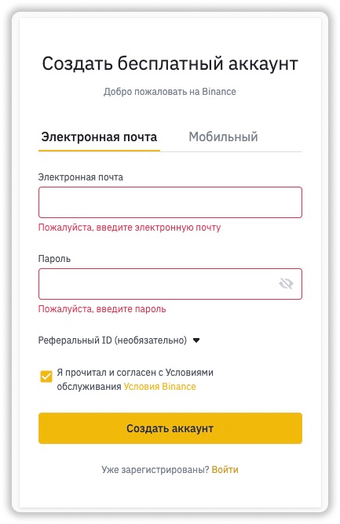
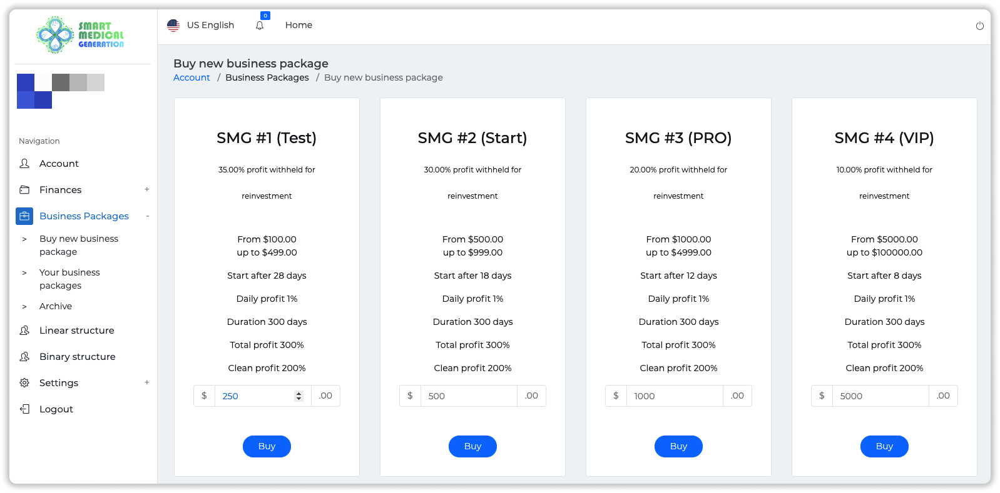
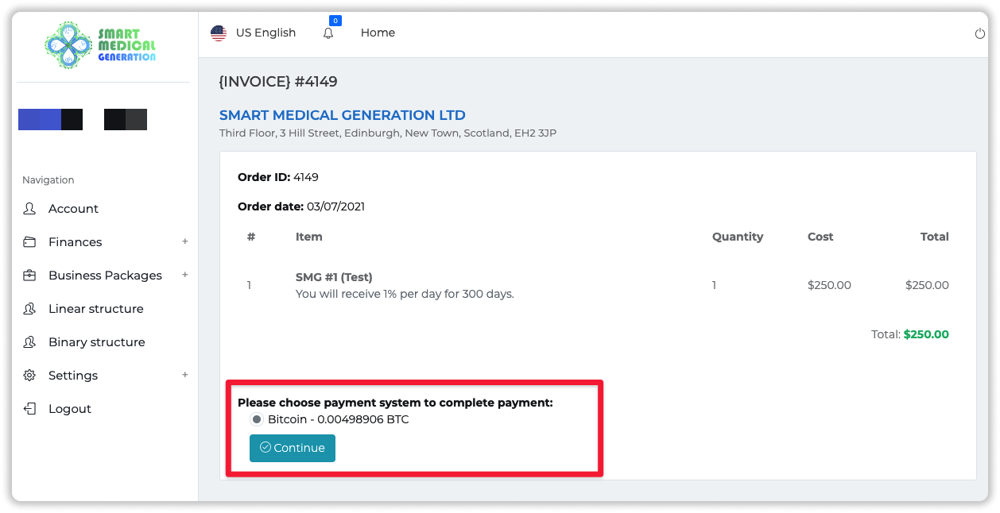
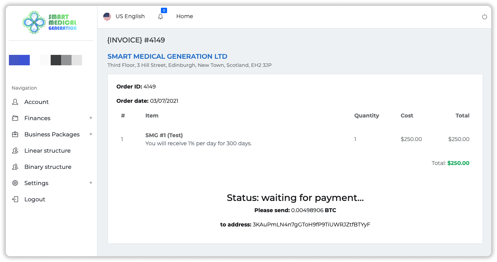
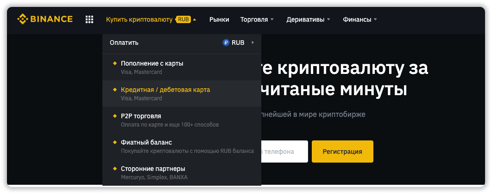
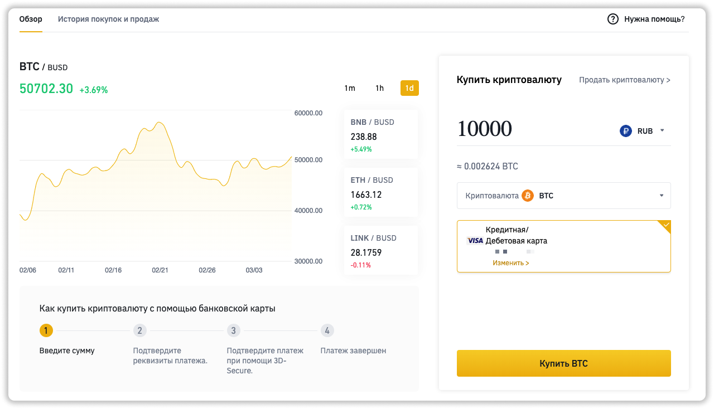
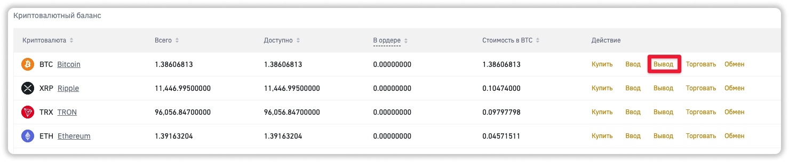
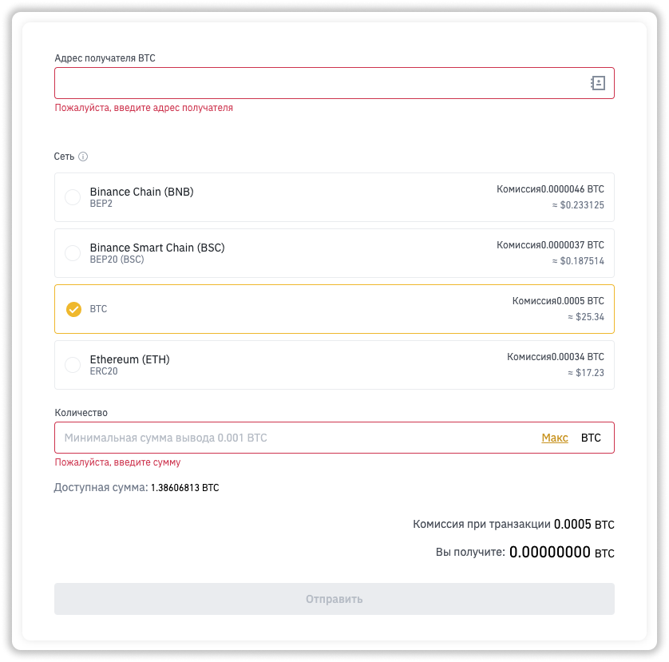
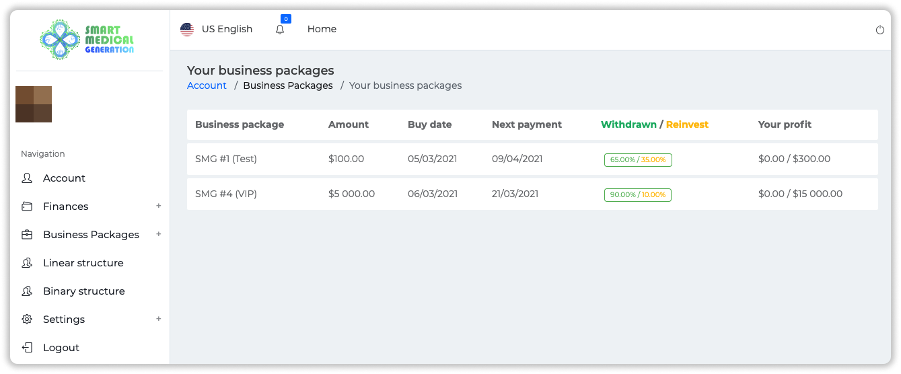

### ❓ Если возникнут вопросы → **[Telegram](https://t.me/girlwithbun)**
### ❗️**ВАЖНО:** После регистрации первого аккаунта - написать мне. Я поставлю вас в бинарной структуре и вы далее уже можете создавать нижестоящие аккаунты. 
***

`Для регистрации в Smart Medical Generation (SMG) и инвестиции в проект нужно:`

- Банковская карта и криптовалюта (Bitcoin или USDT (TRC20))
- Электронная почта
- Регистрация на бирже binance.com

## Шаг 1: Регистрируемся в Smart Medical Generation
***

**1.1** Переходим по ссылке для регистрации - [https://smartmedicalgeneration.ltd/r/valyapar](https://smartmedicalgeneration.ltd/r/valyapar) и заполняем все поля. Потом нажимаем **Continue**

**1.2** На электронную почту придёт письмо. В нём необходимо взять код подтверждения и вставить в форму на сайте. Потом нажать **Continue**. 

❗️Код подтверждение может придти в спам или в раздел промо. Если не можете найти, то в поиске почты введите SMG.

## Шаг 2: Регистрируемся на binance.com чтобы пополнить счёт SMG
***

Инвестиционный пакет покупается с помощью криптовалюты Bitcoin или USDT (TRC20). Можете пополнить счёт с любого вашего кошелька, но я всё делаю через binance, так как там можно и купить и вывести криптовалюту за секунды на банковскую карту.

**2.1** Переходим по ссылке [binance.com](https://accounts.binance.com/ru/register) и регистрируемся.

**2.2** Проходите верификацию. Она занимает 1-2 дня.

Кликай, если нужна [Подробная инструкция по прохождению верификации на binance](/verifikaciya-binance/).

## Шаг 3: Покупаем инвестиционный пакет
***
В данном примере пополняем через биржу binance.com. Если у вас другой кошелек, скорее всего вы знаете как им пользоваться.

**3.1** Заходите в ваш личный кабинет Smart Medical Generation и переходите в раздел **[Buy new business package](https://smartmedicalgeneration.ltd/account/packages/buy)**

**3.2** Выбираете нужный вам инвестиционный пакет SMG. Вводим необходимую сумму и нажимаем **Buy**.

**3.3** Выбираем способ оплаты и нажимаем **Continue**. Иногда доступен способ оплаты только в Bitcoin, так как сеть TRC20 бывает загружена.

**3.4** Появится окно оплаты. Будет написано сколько криптовалюты нужно перевести и на какой кошелёк.

Пункты 3.5-3.8 можно пропустить, если у вас есть криптовалюта на бирже binance.

**3.5** Заходим на [binance.com](http://binance.com) и слева сверху нажимаем **Купить криптовалюту → Кредитная / Дебетовая карта**

**3.6** Выбираем вашу национальную валюту, у меня это RUB. Ниже выбираем BTC. Вводим то количество рублей, чтобы оно соответствовало нужному количеству криптовалюты.. 

**Важно: купите с запасом на 1 000 рублей больше, так как будут комиссии при переводе.**

**3.7** Нажимаем на кнопку **Купить** и вводим данные банковской карты в форме.

**3.8** Подтверждаете покупку с помощью SMS и кода, который пришел на почту. Если транзакция отклонена, то нужно написать в поддержку, чтобы binance верифицировал вашe банковскую карту.

**3.9** Переходите в раздел **Кошелек → Фиат и спор**

**3.10** Напротив BTC нажимаете **Вывод**

**3.11** Вставляете кошелек с Smart Medical Generation. Выбираете сеть BTC, если переводите в Bitcoin. Если в USDT, то сеть TRC20. Вводите количество BTC, которое показывается в SMG плюс комиссию, которая указывается ниже. И нажимаем **Отправить**. Вывод подтверждается SMS и кодом на вашу почту.

**3.12** Всё. После оплаты больше ничего делать не нужно. Деньги зачисляются от 30 минут до 4 часов. Терпение!

**3.13** Купленная лицензия отобразится в разделе **Your business packages**

***
### Полезные инструкции

[Инструкция по выводу денег в Smart Medical Generation](https://pyromid.ru/vivod-smg/)

[Как выйти в безубыток быстрее в проекте Smart Medical Generation](https://pyromid.ru/bistryi-vihod-v-bezubitok-v-smg/)

[Полный обзор проекта Smart Medical Generation](https://pyromid.ru/obzor-proekta-smg-ltd/)

***
