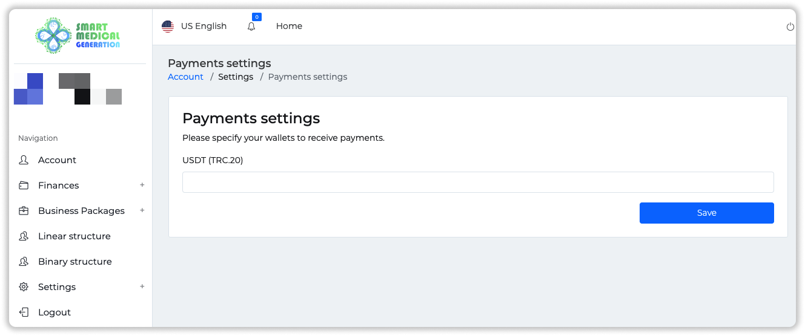
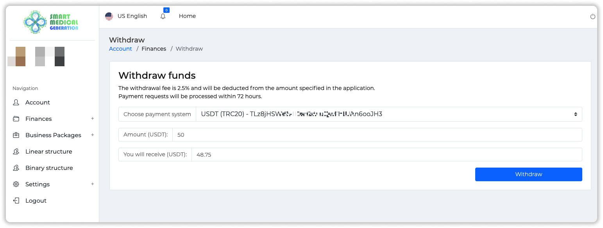
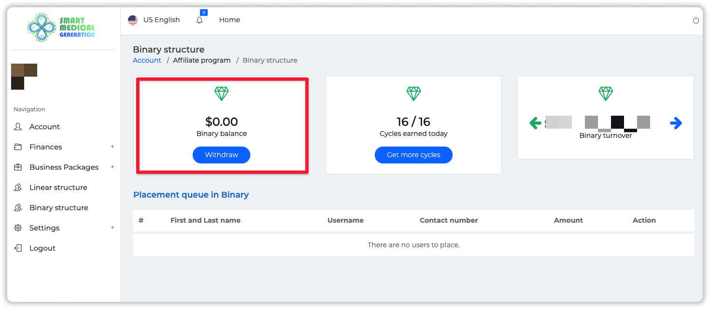
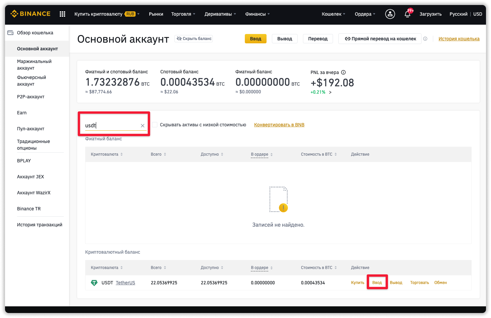
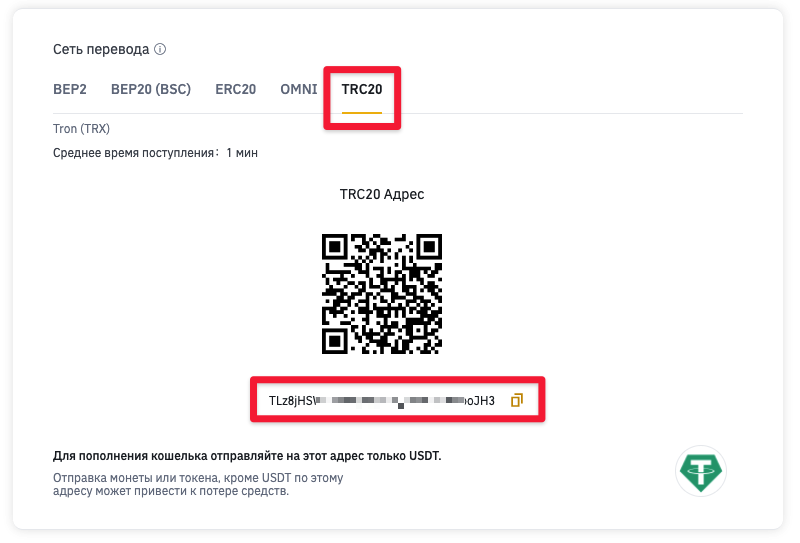

### ❓ Если возникнут вопросы → **[Telegram](https://t.me/girlwithbun)**
### 🎥 [Видео с выводом](#вывод-smg)
***

## Шаг 1: Привязываем кошелёк в личном кабинете Smart Medical Generation
***

**1.1** Заходим в раздел **Setting → Payments**.

**1.2** Вставляем в поле кошелёк USDT на сети TRC20 и нажимаете **Save**. Если у вас нет кошелька USDT на сети TRC20, то [кликай сюда](#создаем-кошелек-usdt).

**1.3** Теперь переходим в раздел **Finances → Withdraw**. Сверху высветится ваш кошелёк. Вводите доступную сумму для вывода и нажимаете **Withdraw**. Баланс можно проверить в разделе **Finances → Wallet**.

❗️Теперь ждём по регламенту 72 часа.

## Важные нюансы
***

Для вывода бинарного бонуса нужно сначала зайти в раздел **Binary structure** и нажать **Withdraw**. Деньги с бинарного баланса перетекут в основной кошелек. И только оттуда нужно уже выводить себе. 

## Создаем кошелёк USDT TRC20 на binance 
***

**2.1** Переходим по ссылке [binance.com](https://accounts.binance.com/ru/register) и регистрируемся.

**2.2** Проходите верификацию. Она занимает 1-2 дня.

Кликай, если нужна [Подробная инструкция по прохождению верификации на binance](/verifikaciya-binance/).

**2.3** Переходите в раздел **Кошелек → Фиат и спот**

**2.4** Ищите там криптовалюту USDT. Если не можете найти глазами воспользуйтесь поиском. И нажимаете напротив неё кнопку **Ввод**

**2.5** Выбираем сеть TRC20 и под QR кодом будет ваш кошелёк. Его копируем и вставляем в личном кабинете SMG.

## Видео-инструкция по выводу 
***

<iframe width="560" height="315" src="https://www.youtube.com/embed/d_WWH26ecqk" title="YouTube video player" frameborder="0" allow="accelerometer; autoplay; clipboard-write; encrypted-media; gyroscope; picture-in-picture" allowfullscreen></iframe>

***
### Полезные инструкции

[Инструкция по регистрации и инвестирования в Smart Medical Generation](https://pyromid.ru/registraciya-popolnenie-smg/)

[Как выйти в безубыток быстрее в проекте Smart Medical Generation](https://pyromid.ru/bistryi-vihod-v-bezubitok-v-smg/)

[Полный обзор проекта Smart Medical Generation](https://pyromid.ru/obzor-proekta-smg-ltd/)

***
