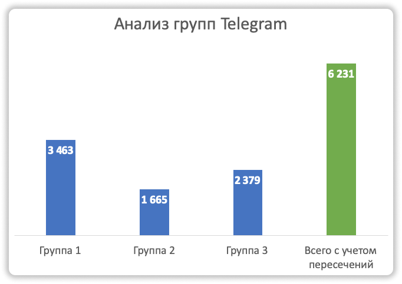
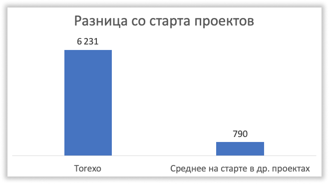
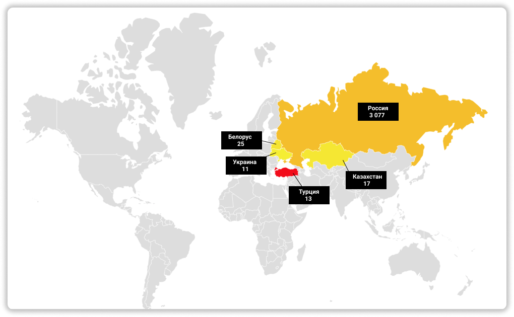
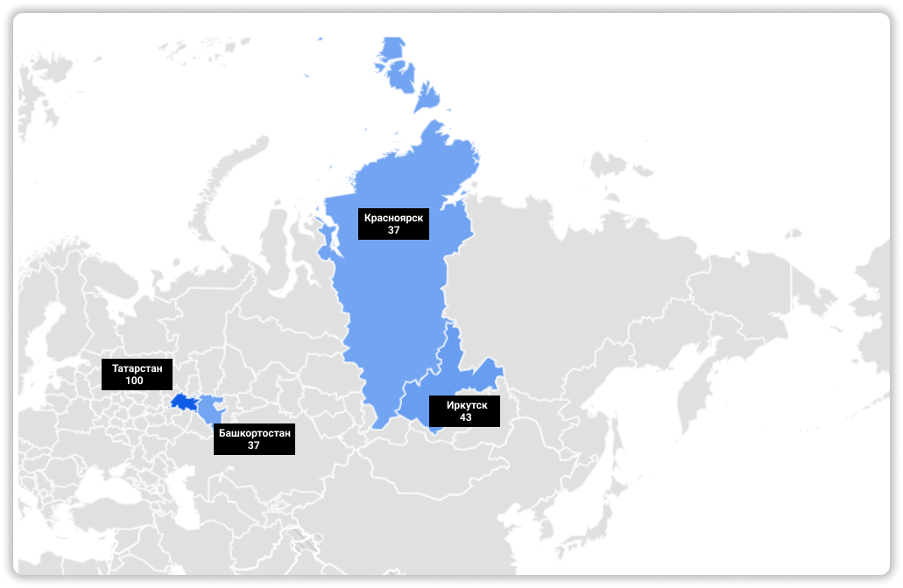

### 📱 Telegram канал → **[Telegram](https://t.me/pyromidinvest)**
### 🎥 [Видео-аналитика в конце статьи](#аналитика-торексо-за-предстарт)
***

Это конечно нечто. Такого ажиотажа, как в этом проекте Torexo я еще не видел. Визг, очереди, занимайте места в бинаре, готовьте бабки на старте. WTF!? Ребята камон, никуда поезд без вас не уедет. Ниже я сделал анализ проекта и кратко - **пока не инвестируем и ждем отмашки**. Можно только зарегистрироваться и всё! 

💡 Скоро стартует новый хайп. Вступайте в [мой Telegram канал](https://t.me/pyromidinvest), зайдем на самом старте. В Торексо уже поздно!

## Посещение сайта Torexo
***

Боже. Еще сайт [torexo.com](https://torexo.com/) толком не открылся, а уже 10 000 визитов за май! Я представляю когда будет старт, сайт повиснет нафиг. Надеюсь что админы адекватные и проведут нормальное нагрузочное тестирование.

## Анализ групп в Telegram по Torexo
***

Я сделал аналитику групп в телеге и выяснилось, что на старте заходит в проект около 6 200 пользователей. Данные считал по топ-3 группа в Telegram и исключил пересечение людей. 

## Сравнение количество людей на старте в Torexo и других проектах
***

Как видим из графика. В Torexo в 8 раз больше людей заходит чем в другие хайп проекты со старта. Это дичь конечно полная. Предчувствие очень плохое!

## Международная ли компания Torexo?
***

Чего-то по статистики я не вижу никакой международки вообще. Блин я предвзято не отношусь. Просто видно, что ажиотаж в странах СНГ только. Наши ребята еще зададут жару, но, где же Италия, Испания и другие? Видно что Россия сейчас лидирует по количествам запросов за май.  

## Какие регионы подхватили хайп-пирамиду Torexo?
***

Ребята из Казани - вы просто ТОП. Блин замечаю, что Республика Татарстан люто качает все проекты. Но, пожалуйста не теряйте бдительность. Итого, всплеск хайпа пришлось на Татарстан. Циферки на графике говорят о популярности. Максимальное значение 100. 

## Видео 
***
<iframe width="560" height="315" src="https://www.youtube.com/embed/KThGolLheNk" title="YouTube video player" frameborder="0" allow="accelerometer; autoplay; clipboard-write; encrypted-media; gyroscope; picture-in-picture" allowfullscreen></iframe>

***
### Полезные инструкции
[Подготовка к новому хайпу Share Finance в Telegram](https://t.me/pyromidinvest)

***
