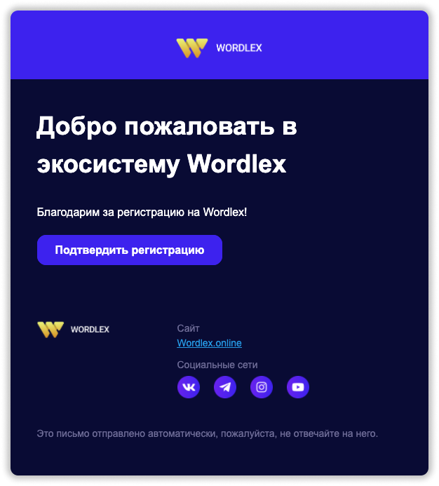
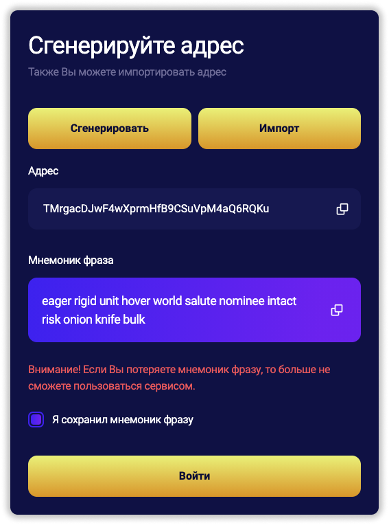
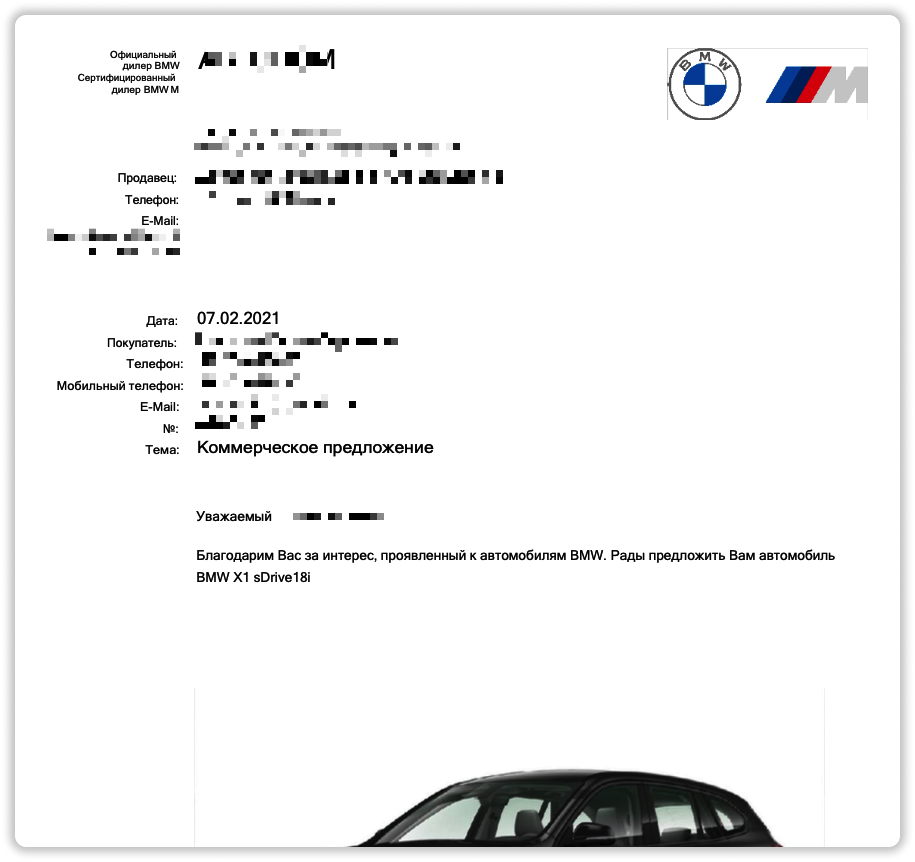
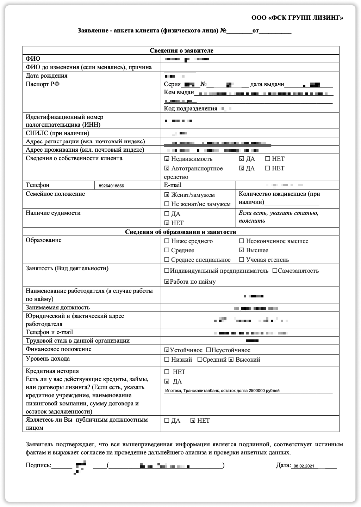
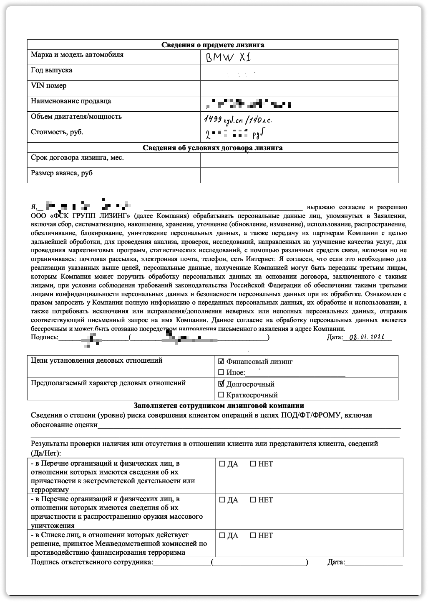
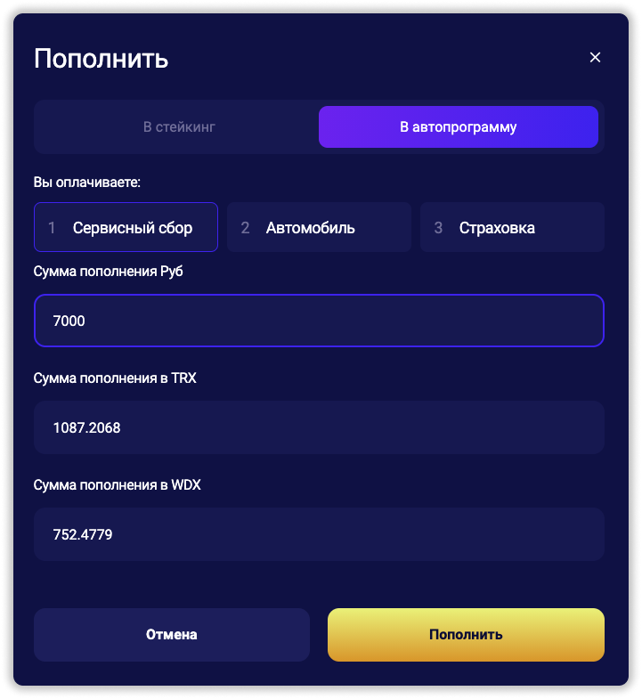
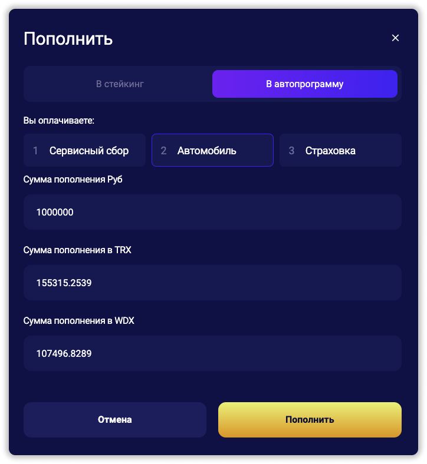
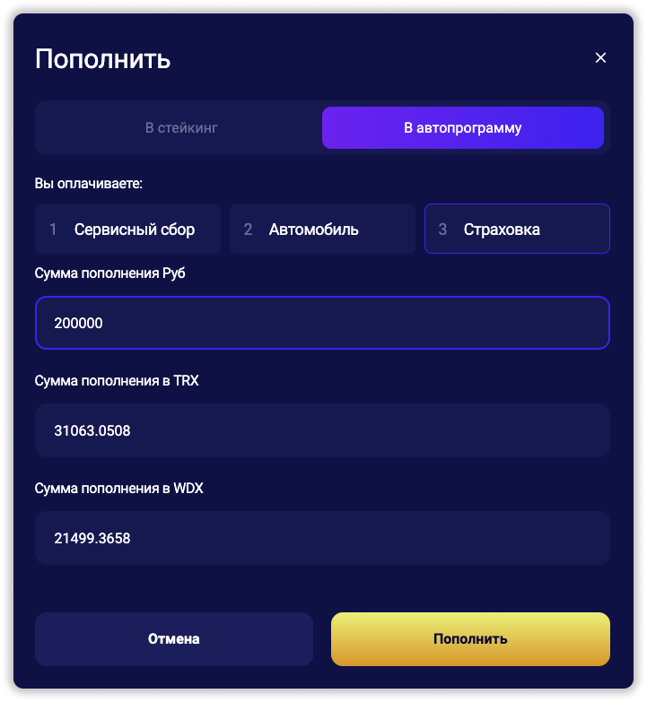

***
📖 [Официальная инструкция Wordlex](https://wordlex.online/wp-content/uploads/Instruktsiya.pdf)

📚 [Список документов, которые вы получите на руки](https://wordlex.online/wp-content/uploads/Dokumenty.pdf)

❗️ Если возникают вопросы, можно написать [онлайн-консультанту Wordlex](https://wordlex.info/) или мне в [Telegram](https://t.me/girlwithbun).
***

# Инструкция по покупке авто за 50% 
***

● Подробно о проекте рассказываю [тут](https://pyromid.ru/info-wordlex/).
● Как я лично купил авто от Wordlex смотрите в [видео на YouTube](https://www.youtube.com/watch?v=V3j39mg-pE0&t=524s)
● [Ответы на часто-задаваемые вопросы](#faq-wordlex-instr-avto)
● Есть онлайн-консультант, который ответит на все ваши вопросы и поможет от сбора документов до получения автомобиля. Просто нажмите **[сюда](https://wordlex.info/)** и начинаете разговор с консультантом.

## Шаг 1: Регистрируемся в проекте Wordlex
***

**1.1** Переходим по **[ссылке](https://lk.wordlex.online/?ref=TSPkmo2UFv6CkpBnhiYD8BNQj85i3GG9Pe)** 
Именно по этой ссылке будет доступна скидка 50%.

**1.2** Заполняем необходимые поля: email, пароль и подтверждение пароля.

**1.3** Подтверждаем регистрацию на вашем email. Обязательно нажимаем кнопку **Подтвердить регистрацию**. Если не видите письмо, посмотрите в папке спам.

**1.4** После нажания на кнопку **подтверждения регистрации** вас перекинет на сайт и предложит сгенерировать или импортировать свой TRC20 кошелек. Если вы не понимаете о чем речь, то сохраните мнемоническую фразу где-то у себя на листе бумаги или на компьютере и нажимайте **Войти**.

❗️ Если вы не сохраните мнемоническую фразу, то потеряете доступ ко всем своим деньгам, переведенным в Wordlex. Будьте внимательными!

**PS:** Вы можете нажать импортировать свой TRC20 кошелек, если он у вас есть. Это безопасно, так как Wordlex работает на сети Трона. Это уже для более продвинутых пользователей. 

## Шаг 2: Выбираем автомобиль в салоне
***

❗️Покупка автомобиля будет в лизинг. Все нюансы и риски я рассказываю в [этой статье](https://pyromid.ru/info-wordlex/). Менеджеру по в автосалоне можете смело говорить, что покупать будете в лизинг на физическое лицо через **ФСК ГРУПП ЛИЗИНГ**.

**2.1** Идёте к любому официальному дилеру в вашем городе и выбираете понравившийся автомобиль. 

**2.2** Заказываете или выбираете из наличия автомобиль и вносите сумму брони, если потребует дилер. Она возвратная, когда автомобиль будет выкуплен лизинговой. Если машин много в наличие у дилера, можете не бронировать.

**2.3** Обязательно просим менеджера автосалона выслать или распечатать коммерческое предложение. Оно нужно, чтобы лизинговая выкупила именно тот автомобиль, который вы выбрали. Ниже пример коммерческого предложения, в нем обязательно менеджер должен указать:
* Наименование дилера с его адресом
* ФИО вашего менеджера и его контакты (телефон + email)
* Данные покупателя. Ваши ФИО и контакты
* Спецификация автомобиля, который вы получите
* Окончательная цена автомобиля

 

## Шаг 3: Заполняем анкету
***

**3.1** Скачиваем анкету от [сюда](https://wordlex.online/autoprogram/). Нажимаете раздел **Документы** и там будет анкета.

**3.2** Заполняете первую и вторую страницу анкеты. Первую страницу можно на компьютере, вторую обязательно от руки. Ниже поясняю важные пункты меню в анкете. Если всё таки не понятно, напишите [онлайн-консультанту](https://wordlex.info/) или мне в [Telegram](https://t.me/girlwithbun), я поясню. Ниже будет пример моего заполненного заявления.

* Первый лист: Кредитная история. Тут можете написать какие кредиты у вас сейчас есть в произвольном формате, можно даже без номера договора. Этот пункт никак не повлияет на выдачу машины.
* Второй лист: 
  Год выпуска, VIN номер можно не писать, если они сейчас не известны. Просто оставьте поле пустым.
  Срок договора лизинга и размер аванса можно не указывать. Если только консультант wordlex вас не попросит.
  Цели установления деловых отношений. Ставите галочку напротив **Финансовый лизинг**
  Предполагаемый характер деловых отношений. Ставите галочку напротив **Долгосрочный**

### Первый лист заявления
 

### Второй лист заявления
 

## Шаг 4: Оплачиваете сервесный сбор
***

**4.1** Для того, чтобы запустить процес подачи документов оплачивается сервисный сбор в размере 7 000 рублей. Он пойдет в счет погашения автомобиля в дальнейшем. Ниже я расскажу как оплатить проще и быстрее.

**4.2** Заводите на этот кошелек TRX на сети TRC20 эквивалентно 7000 рублей. Но лучше чуть с запасом. Номер кошелька можете взять в разделе **Кошелек**

**4.3** Переходим в раздел **Кошелек**. Нажимаем **Купить**. Выбираем вкладку **В автопрограмму**. Вводим сумму 7 000 рублей и нажимаем **Пополнить**.

**4.4** Всё. Сервисный сбор оплачен и теперь нужно написать а чат консультанту. Он вам активирует второй шаг.

### Шаг 5: Загружаем документы

❗️Помните. На каждом шаге вам может помочь [онлайн-консультант](https://wordlex.info/). 

Этот шаг самый простой. Вы должны загрузить все свои документы, а именно:

- Заявление
- Коммерческое предложение
- Пасспорт
- Водительские права

После этого напишите консультанту. Они проверят все документы в течении 1-2 дней и дадут обратную связь. Заявка будет НЕ отобрена, если у вас есть или была **судимость**.

### Шаг 6: Оплачиваем 50% стоимости авто и страховку

После того, как вам согласуют покупку автомобиля, вас попросят оплатить 50% его стоимости. Консультант свяжется с вами в чате и пришлет точную сумму для оплаты.

**6.1** Пополняете свой кошелек с помощью TRX TRC20 на сумму эквивалентную 50% стоимости машину + небольшой запас на 1 000 рублей. 

**6.2** Переходим опять в раздел **Кошелек**. Нажимаем **Купить**. Выбираем вкладку **В автопрограмму**. Вводим сумму 50% вашего авто в рублях и нажимаем **Пополнить**. 

**6.3** Пишем консультанту что оплатили и ждете подтверждения. После этого говорите, что готовы оплатить страховку и ждете инструкций от консультанта. 

**6.4** Стаховка оплачивается аналогично. Переходим опять в раздел **Кошелек**. Нажимаем **Купить**. Выбираем вкладку **В автопрограмму**. Вводим сумму страховки в рублях и нажимаем **Пополнить**.

### Шаг 7: Ждёте выдачи автомобиля

С момента оплаты 50% запускается процесс выкупа автомобиля. Процесс длится до 21 рабочего дня (суббота и воскресенье не в счет).  Как только будут готовы все документы, ваш менеджер из автосалона позвонит вам и пригласит на подписание документов и выдачу автомобиля. С собой иметь только паспорт и водительское удостоверение.

***
❗️ Если остались вопросы, пишите [лично мне](https://t.me/girlwithbun).
***

## Часто-задаваемые вопросы  
***

### 1. В каких странах действует эта программа?
На данный момент только в России. Другие страны СНГ будут подключены позже. Следите за анонсом в моём чате [Telegram](https://t.me/pyromidinvest)

### 2. Есть ли ограничения по цене автомобиля?
Ограничений нет. Вы можете выбрать авто за любую стоимость.

### 3. А можно купить авто с рук или другую б/у?
Нет. Программа работает только с новыми автомобилями из салонов официальных дилеров.

### 4. Покупать нужно в Москве или где?
Покупать можно в любом городе России. Главное чтобы это был официальный дилер.

### 5. Если машины нет в наличие?
Можно и так. Согласовываете с дилером когда будет авто, вносите бронь, которую вернет вам дилер, когда машина выкупится лизинговой компанией.

### 6. Нужно ли бронировать авто самому?
Если вы хотите получить именно тот автомобиль, который уже в наличие - то лучше внести сумму брони дилеру, чтобы его не купил другой человек. Сумма брони будет возвращена как только ваш автомобиль будет выкуплен.

***
### Полезные инструкции
[Wordlex: мой анализ и отзыв об автопрограмме 50%](https://pyromid.ru/info-wordlex/)

[Как купить WDX и пополнить личный кабинет Wordlex?](http://pyromid.ru/popolnenie-wordlex/)

***
