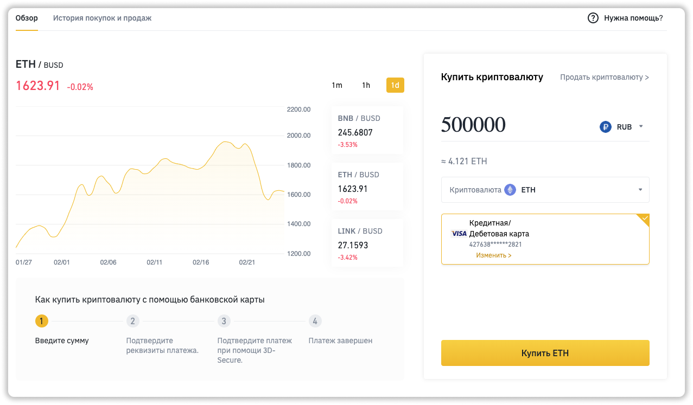

***
❗️Остались вопросы, пишите [лично мне в Telegram](https://t.me/girlwithbun).
***

## Выбираем способ пополнения
***

Запомните. У Wordlex есть тех. поддержка. Если вы не знаете как купить криптовалюту, они могут так же помочь с этим. [Ссылка на тех. поддержку](https://wordlex.info/).

1. Телеграм бот [@chatexchangebot](http://t.me/chatexchangebot)
2. Через биржу binance.com 

Первый способ более простой. Второй способ потребует большего времени, но если вы собираетесь работать с криптовалютами в будущем - советую изучить его.

## 1. Как пополнить с помощью [@chatexchangebot](http://t.me/chatexchangebot)

Данный способ позволит сразу купить токены WDX с банковской карты. Вам придется переводить средства, так что позабодьтесь, что лимитов на банковской карте хватит. Плюс банк возьмет комиссию за перевод.

**1.0** Находите бота Telegram [@chatexchangebot](http://t.me/chatexchangebot)

**1.1** Выбираете пункт **WDX покупка авто за 50%**

**1.2** Бот попросит указать ваш номер кошелька, он находится в разделе **Кошелек**

**1.3** Бот попросит вас ввести сумму в рублях, на которую вы хотите приобрести WDX. Вводите нужную сумму. Но лучше с запасом на 5 000 - 7 000 рублей больше.

**1.4** Далее вы должны ожидать, пока вам не ответит оператор. Обычно 10-20 минут.

**1.5** Потом напишет оператор. Пример сообщения ниже. Вам нужно перевести рубли на указанные реквизиты и нажать кнопку **Написать Админу**. Комиссия бота будет 4%. Говорите админу, что оплата произведена. 

**1.6** В течении 1 часа на вашем балансе Wordlex появятся токены WDX. Вы можете теперь оплачивать автомобиль. Токены WDX отображаются в разделе **Кошелек**.

## 2. Как пополнить с помощью binance.com

Этот способ немного сложнее. Вам нужно будет купить сначала Ethereum, а потом сконвертировать его в WDX. 

**2.1** Регистрируемся на бирже [binance.com](https://www.binance.com/)

**2.2** Проходим обязательно верификацию, это занимает 1 сутки. Инструкция по верификации **[тут](https://pyromid.ru/verifikaciya-binance/)**

**2.3** Как только верификация прошла успешно. Идём в раздел **Купить криптовалюту**, потом **Кредитная/дебетовая карта**

**2.4** Вводите сумму в рублях. Выбираете криптовалюту Ethereum (eth) и оплачиваете. Советую купить на 10 000 рублей больше, так как придется оплатить комиссии.

**2.5** Заходите в раздел **Кошелек**, **Фиат и спот**. Напротив Ethereum нажимаете кнопку **Вывод**.

**2.6** Вводите номер кошелька с Worldex. Выбираете сеть ERC20 и вводите всю сумму в Ethereum.

**2.7** Через 5-10 минут придет Ethereum на баланс Wordlex, его теперь нужно сконвертировать.

**2.8** Заходим в раздел **Кошелек** в Wordlex и в блоке **Купить WDX** вводим ваши Ethereum и нажимаем **Пополнить**. Ждем около 2 минут и ваш баланс поменяется. 

**2.9** Всё, теперь можете оплачивать автомобиль.

***
### Полезные инструкции

[Инструкция по покупке автомобиля от Wordlex за 50%](https://pyromid.ru/avtoprogramma-wordlex/)

[Wordlex: мой анализ и отзыв об автопрограмме 50%](http://pyromid.ru/info-wordlex/)

***
